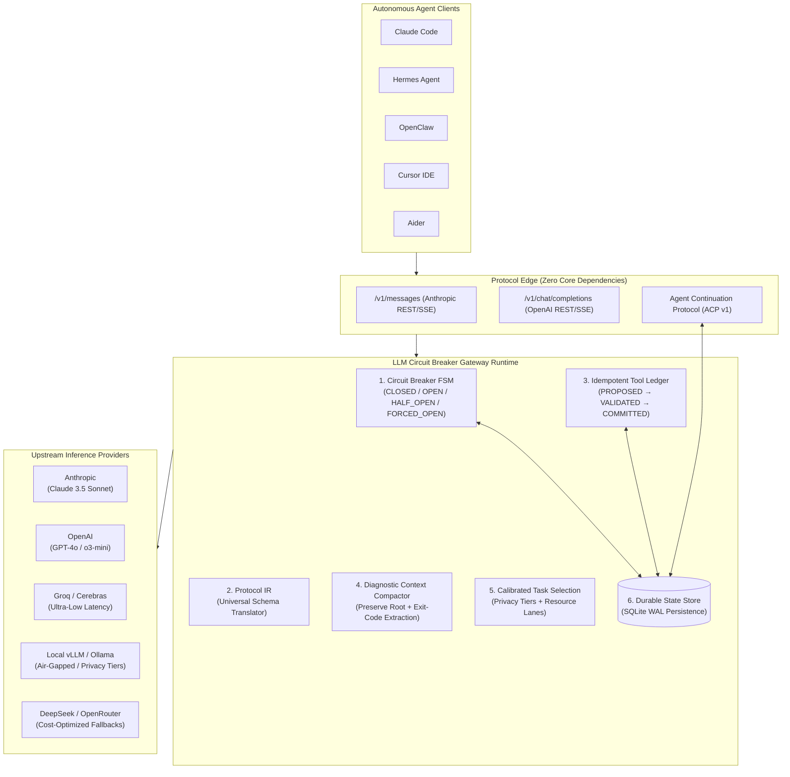

<div align="center">

# ⚡ LLM Circuit Breaker

**The Agent-Resilient Gateway for Autonomous AI Systems**

*Zero-loss semantic failover • Idempotent tool ledger • Formal 6-state FSM • Protocol IR • Diagnostic context compaction*

[](https://github.com/d2epak/llm-circuit-breaker/actions/workflows/ci.yml)
[](https://www.python.org/downloads/)
[](https://opensource.org/licenses/MIT)
[]()
[]()
[]()
[-100%25-blueviolet.svg)](docs/BENCHMARKS.md)

<br/>

[⚡ Instant Demo](#-instant-demo-zero-api-keys) • [🚀 Quickstart](#-quickstart) • [🤖 Agent Drop-In](#-agent-drop-in-integration) • [🧠 Core Architecture](#-architecture-the-6-core-pillars) • [📊 Benchmarks](#-empirical-benchmarks-b1b15) • [🥊 Comparison](#-architectural-comparison) • [📚 Docs](#-documentation-hub)

</div>

---

## 💥 Why Standard Proxies Break Autonomous Agents

Modern LLM proxies (**LiteLLM**, **Portkey**, **Cloudflare AI Gateway**) were architected for stateless chat completions. When paired with **autonomous agent loops** (**Claude Code**, **Hermes Agent**, **Cursor**, **Aider**, **OpenClaw**), standard proxies cause silent task corruption:

| Failure Mode | Standard Reverse Proxy Behavior | **LLM Circuit Breaker** Resolution |
|---|---|---|
| **Ghost Side-Effects** *(Replay Hazard)* | On upstream 5xx or disconnect, blindly resends payload. A destructive tool call (`execute_bash("rm -rf ...")` or database mutation) executes twice. | **Idempotent Tool Execution Ledger**: Stages calls through `PROPOSED` $\to$ `VALIDATED` $\to$ `SUBMITTED` $\to$ `COMMITTED`. Cached receipts suppress duplicate executions during retries. |
| **Context Window Overflow** | Failing over from a 128k context provider to a 32k provider triggers HTTP 400. Proxies blindly truncate from the head, erasing system prompts and root instructions. | **Diagnostic Context Compaction**: Preserves root user goal and system prompt; summarizes intermediate tool logs into structured diagnostics (exit codes, error snippets). |
| **Protocol Incompatibility** | Blindly forwards raw JSON payloads. Anthropic-formatted tools crash when sent to OpenAI or Gemini endpoints. | **Protocol Intermediate Representation (IR)**: Universal translation across Anthropic (`/v1/messages`), OpenAI (`/v1/chat/completions`), and Gemini schemas. |
| **Cascade Outages** | Simple cooldown timers or naive retry loops hammer failing endpoints, triggering exponential rate-limit penalties across clusters. | **Formal 6-State Circuit Breaker FSM**: Count- and time-based sliding windows with strictly bounded half-open probe permits (`half_open_active <= max_calls`). |
| **Mid-Stream Model Splicing** | Drops connection mid-stream and blindly switches providers, generating half-OpenAI / half-Anthropic token gibberish. | **Interruption Boundary Protection**: True streaming emits an explicit interruption boundary event rather than splicing tokens mid-flight. |
| **Cross-Pool Quota Exhaustion** | A rate limit in an exploratory coding agent poisons shared credentials for critical production workloads. | **Calibrated Task Selection**: Independent `ResourceLaneStore` isolates rate limits per credential, model, and pool with atomic pre-dispatch reservations. |

---

## ⚡ Instant Demo (Zero API Keys)

Simulate provider outages, semantic failover, circuit tripping, and self-healing recovery in under **2 seconds** without installing dependencies or setting API keys:

```bash
python -m llm_circuit_breaker.demo
```

```text
===========================================================================
⚡ LLM CIRCUIT BREAKER — DETERMINISTIC RESILIENCE & SEMANTIC FAILOVER DEMO
===========================================================================
▶ STEP 1: Dispatching turn to Primary Provider (Cerebras)...
  ✔ Result: Primary response: Tool code executed successfully
  ✔ Selected Endpoint: primary-cerebras (Attempts: 1) | State: CLOSED

▶ STEP 2: Primary suffers 503 Outage; Gateway initiates Semantic Failover...
  ✔ Failover Succeeded! Response: Secondary (Groq) fallback response
  ✔ Primary Breaker State: OPEN (Tripped by 503 server errors)
  ✔ Observable FailoverPlan: primary-cerebras -> secondary-groq (Reason: overloaded)

▶ STEP 3: Next Request arrives while Primary is OPEN...
  ✔ Dispatched directly to: secondary-groq (Primary bypassed with 0 upstream load)

▶ STEP 4: Advancing clock by 20 seconds; Testing Self-Healing Recovery...
  ✔ Evaluated Breaker State: HALF_OPEN (Admits bounded probe permits)
  ✔ Probe calls succeed -> Breaker Reset! Primary State is now: CLOSED
===========================================================================
```

---

## 🏛️ System Architecture



---

## 🚀 Quickstart

### 1. Installation

Install the package directly (requires **Python 3.10+**):

```bash
pip install llm-circuit-breaker
```

*(Zero third-party core dependencies. The base package runs purely on the Python standard library with optional SQLite WAL durability).*

### 2. Launch the Local Proxy Gateway

Start the resilience proxy locally on port 4001:

```bash
llm-proxy --port 4001
# Or run as a module:
python -m llm_circuit_breaker.proxy --port 4001
```

By default, the proxy runs fully isolated. If you want automatic credential discovery from local environment files, use `--discover`:

```bash
llm-proxy --port 4001 --discover
```

---

## 🤖 Agent Drop-In Integration

Seamlessly point your favorite autonomous agent at `llm-circuit-breaker` by overriding the base URL:

### Claude Code
```bash
export ANTHROPIC_BASE_URL="http://127.0.0.1:4001"
claude
```

### Hermes Agent / OpenClaw
```bash
export OPENAI_BASE_URL="http://127.0.0.1:4001/v1"
export OPENAI_API_KEY="sk-dummy" # Gateway manages actual provider credentials
hermes
```

### Cursor IDE
Navigate to **Cursor Settings** $\to$ **Models** $\to$ **OpenAI API Key**:
- Check **Override OpenAI Base URL**
- Set Base URL: `http://127.0.0.1:4001/v1`

### Aider
```bash
aider --openai-api-base http://127.0.0.1:4001/v1 --model openai/gpt-4o
```

---

## 🐍 Python SDK Usage

Use the deterministic gateway directly within Python agent applications:

```python
import os

from llm_circuit_breaker import Endpoint, GatewayExecutor, ModelProfile, NormalizedMessage, NormalizedRequest

executor = GatewayExecutor()

# Nothing is registered by default: declare at least one endpoint in the pool you will call.
executor.capability_registry.register_endpoint(Endpoint(
    id="groq-llama",
    provider="groq",
    model="llama-3.3-70b-versatile",
    base_url="https://api.groq.com/openai/v1",
    env_key="GROQ_API_KEY",          # name of the key looked up in `api_keys` below
    pool="coding",
    profile=ModelProfile("groq", "llama-3.3-70b-versatile", context_window=131072, supports_tools=True),
))

request = NormalizedRequest(
    model="default",
    messages=[NormalizedMessage(role="user", content="Deploy application")],
)

response, decision, ledger = executor.execute(
    request,
    pool="coding",
    strategy="reliability_aware",
    api_keys={"GROQ_API_KEY": os.environ["GROQ_API_KEY"]},
)
print(f"Selected Endpoint: {decision.selected_endpoint.id}")
print(f"Response: {response.content}")
```

---

## 🧠 Architecture: The 6 Core Pillars

### 1. Formal 6-State Circuit Breaker FSM
Implements an industrial-grade finite state machine (`CLOSED`, `OPEN`, `HALF_OPEN`, `FORCED_OPEN`, `DISABLED`, `METRICS_ONLY`) with:
- **Time- and count-based sliding error windows**: Evaluates failure rate thresholds without bias from stale errors.
- **Permanent Error Taxonomy & Dead-List Pruning**: Distinguishes permanent configuration & lifecycle errors (401 Bad Key, 402 Out of Credits, 404/410 EOL) from transient network failures (429, 503). Instantly blacklists dead models pre-flight to short-circuit future failing HTTP calls.
- **Failover Telemetry & Transparency**: Surfaces `X-LCB-Failover`, `X-LCB-Active-Model`, `X-LCB-Selected-Endpoint` HTTP headers and attaches `lcb_failover` payload metadata so agents/UIs know when failovers occur.
- **Bounded Half-Open Probes**: Strictly enforces `active_probes <= max_half_open_calls` to prevent thundering herds from overwhelming recovering providers.
- **`Retry-After` Compliance**: Automatically extracts and honors upstream rate-limit headers.
- Learn more in [Reliability Model](docs/RELIABILITY_MODEL.md).

### 2. Agent Continuation Protocol (ACP v1) & Durable State
Long-running agent workflows cannot depend on ephemeral memory:
- **Turn Checkpoints**: Preserves active context, token expenditure, and execution state in a local **SQLite WAL store**.
- **Operation Lifecycle Receipts**: Transitions each operation through `PREPARED` $\to$ `SUBMITTED` $\to$ `ACKNOWLEDGED` $\to$ `INDETERMINATE`.
- Learn more in [Agent Continuation Protocol](docs/AGENT_CONTINUATION_PROTOCOL.md) and [Durable State](docs/DURABLE_STATE.md).

### 3. Universal Protocol Intermediate Representation (IR)
Converts seamlessly between heterogeneous provider formats on failover:
- Canonical dataclasses: `NormalizedRequest`, `NormalizedMessage`, `NormalizedToolCall`, `NormalizedResponse`.
- Dynamic translation across Anthropic (`/v1/messages`), OpenAI (`/v1/chat/completions`), and Google Gemini.
- Preserves thinking signatures, tool definitions, and system prompts across migrations.
- Learn more in [Semantic Failover](docs/SEMANTIC_FAILOVER.md).

### 4. Idempotent Tool Execution Ledger
Prevents the catastrophic "double-spend" of autonomous coding agents:
- **Receipt Suppression**: Tool calls record their unique call ID and content hash. If an upstream drops after execution, the retry matches the committed receipt and serves cached output without re-executing.
- **Rule 3 Tool Safety**: Fails closed on missing required arguments. Repairs syntactic JSON/markdown fences but strictly forbids hallucinating or altering semantic arguments.
- Learn more in [Tool Safety & Idempotency](docs/TOOL_SAFETY.md).

### 5. Diagnostic Context Compaction (Rule 2)
When failing over to models with smaller context windows:
- **Preserves Critical Anchor Points**: Never truncates the initial system prompt or root user instructions.
- **Diagnostic Tool Extraction**: Instead of deleting tool results, replaces verbose build/lint/test logs with structured status lines (`[Exit 0: 42 files passed, 1 warning]`).
- Learn more in [Context Model](docs/CONTEXT_MODEL.md).

### 6. Calibrated Task Selection & Privacy Tiers
Intelligent candidate selection across multiple dimensions:
- **Data Privacy Profiles**: Strictly enforces routing policies (`AIR_GAPPED`, `LOCAL_ONLY`, `PUBLIC_ALLOWED`).
- **Independent Resource Lanes**: Keeps credential quotas isolated to prevent cross-pool starvation.
- **Confidence Calibration**: Adjusts selection probabilities based on historical empirical endpoint performance.
- Learn more in [Routing Policy](docs/ROUTING_POLICY.md).

---

## 📊 Empirical Benchmarks (B1–B15)

Evaluated across **15 deterministic stress scenarios** (permanent outages, 429 rate limits, timeouts, context overflows, malformed tool syntax, semantic schema violations, tool idempotency, mid-stream disconnects, provider cascades, pool isolation, cost ceilings, tool-reliability routing, and capability mismatches) against 6 in-process baseline architectures.

Results from official reproducible run (`results/2026-09-06-1943ba8/report.md`, 3 iterations, seed 42):

| System Architecture | Request Completion | Autonomous Recovery | Median Latency | P95 Latency | Semantic Error Rate |
|---|:---:|:---:|:---:|:---:|:---:|
| **⚡ LLM-Circuit-Breaker-V3** | **100.0%** | **80.0%** | **12.12 ms** | **313.64 ms** | **0.0%** |
| **Baseline-A (Direct Provider)** | 0.0% | 0.0% | 0.02 ms | 0.40 ms | 20.0% |
| **Baseline-B (Same-Provider Retry)** | 20.0% | 20.0% | 0.05 ms | 0.57 ms | 20.0% |
| **Baseline-C (Static Fallback)** | 33.3% | 33.3% | 0.03 ms | 0.32 ms | 20.0% |
| **Baseline-D (Breaker + Static Fallback)** | 33.3% | 33.3% | 0.04 ms | 0.29 ms | 20.0% |
| **Baseline-E (V1 Prototype Router)** | 53.3% | 53.3% | 0.13 ms | 5.07 ms | 20.0% |
| **Baseline-F (Standard Router Seam)** | 33.3% | 33.3% | 7.98 ms | 24.68 ms | 20.0% |

> **Key Takeaways**:
> 1. **Zero Semantic Errors**: LLM-Circuit-Breaker-V3 achieves 0.0% semantic error rate by strictly failing closed on invalid tool arguments (B6, B7, B14), whereas all baselines forward malformed tool calls that crash agent loops.
> 2. **100% Completion**: Only V3 survives context overflows (via diagnostic compaction) and rate limits (via sliding-window failover and `Retry-After` backoff).
> 3. **Reproduce Locally**: Run `python -m benchmarks.run` to execute the full test harness. Detailed methodology available in [docs/BENCHMARKS.md](docs/BENCHMARKS.md).

---

## 🥊 Architectural Comparison

How **LLM Circuit Breaker** compares to industry proxies and edge gateways:

| Architectural Dimension | **⚡ LLM Circuit Breaker** | **LiteLLM Proxy** | **Cloudflare AI Gateway** | **Portkey Gateway** | **OpenRouter** |
|---|:---:|:---:|:---:|:---:|:---:|
| **Circuit Breaker Engine** | **6-State FSM** with bounded half-open probe permits & sliding windows | Cooldown timer (`time + 60s`), no permit concurrency limits | Dynamic retry policy | Proprietary cloud breaker (enterprise tier) | Static upstream server retry |
| **Agent Tool Execution Ledger** | **Yes**: Tracks lifecycle receipts, prevents duplicate execution on retry | ❌ No: Blind replay on 5xx drops | ❌ No | ❌ No | ❌ No |
| **Context Compaction on Failover** | **Yes**: Diagnostic compaction preserves root goal + extracts exit codes | ❌ No: Naive head/tail truncation | ❌ No | ❌ No | ❌ No |
| **Universal Protocol IR** | **Yes**: Native cross-translation (Anthropic $\leftrightarrow$ OpenAI $\leftrightarrow$ Gemini) | Partial: In-memory dict remapping | ❌ No: Separate endpoints | Partial: Gateway REST wrappers | ❌ No: Standard OpenAI schema |
| **Streaming Safety** | **Interruption Boundary**: Prevents mid-stream model splicing | Splicing on failure | Aborts stream | Aborts stream | Aborts stream |
| **Deployment Footprint** | **Zero core dependencies**; self-contained Python package | Heavy dependencies (FastAPI, Prisma, Redis, Postgres) | Cloudflare Edge Worker (Cloud only) | SaaS cloud or enterprise container | Cloud-only API broker |
| **Privacy & Security** | **SSRF protection, CRLF sanitization, air-gapped routing tiers, local-first** | Cloud telemetry by default | Cloud control plane | Cloud control plane | Third-party proxy |

*See detailed technical comparisons in [docs/COMPETITOR_MATRIX.md](docs/COMPETITOR_MATRIX.md).*

---

## 🛡️ Security & Operational Hardening

LLM Circuit Breaker is built defensively for mission-critical self-hosted environments:

- **SSRF Defense**: Automatically blocks upstream URLs resolving to loopback (`127.0.0.1`) or RFC 1918 private subnets unless explicitly enabled via `LLM_BREAKER_ALLOW_LOCAL_UPSTREAM=1`. Cloud metadata endpoints (`169.254.169.254`) are **permanently refused**.
- **Payload Limits**: Rejects requests and responses exceeding 10 MB to prevent memory exhaustion attacks.
- **Credential Redaction**: Emits structured JSON events on the `llm_circuit_breaker.events` logger with API keys and bearer tokens strictly masked.
- **Clean Environment Separation**: Zero network calls or file scans on import. Credential discovery is strictly opt-in.

---

## 📚 Documentation Hub

Explore in-depth design specifications, formal models, and operational runbooks:

- 🏛️ [Architecture Overview](ARCHITECTURE.md) — System design, components, and dataflow.
- 🛡️ [Reliability & FSM Model](docs/RELIABILITY_MODEL.md) — Formal 6-state FSM state transitions.
- 🗂️ [Failure Taxonomy](docs/FAILURE_TAXONOMY.md) — Comprehensive classification of LLM failure modes.
- 🔄 [Semantic Failover & Protocol IR](docs/SEMANTIC_FAILOVER.md) — Cross-model payload translation.
- 📜 [Tool Safety & Idempotency Ledger](docs/TOOL_SAFETY.md) — Replay suppression and schema validation.
- 🗜️ [Context Compaction Engine](docs/CONTEXT_MODEL.md) — Hierarchical compaction preserving anchor instructions.
- 🌊 [Streaming Architecture](docs/STREAMING.md) — Native SSE pass-through and interruption boundaries.
- 🤖 [Agent Continuation Protocol (ACP v1)](docs/AGENT_CONTINUATION_PROTOCOL.md) — Durable session recovery.
- 💾 [Durable Persistence (SQLite WAL)](docs/DURABLE_STATE.md) — Storage engine and ACID guarantees.
- 🎯 [Routing Policy & Calibration](docs/ROUTING_POLICY.md) — Scorecards, privacy tiers, and resource lanes.
- 🧪 [Client Compatibility Matrix](docs/CLIENT_COMPATIBILITY.md) — Recorded fixtures for Claude Code, Hermes, OpenClaw.
- 📊 [Benchmark Report (B1–B15)](docs/BENCHMARKS.md) — Full methodology and empirical data.
- 🥊 [Competitor Deep-Dive](docs/COMPETITOR_MATRIX.md) — Exhaustive feature-by-feature comparison.
- 🛠️ [Production Operations Runbook](docs/OPERATIONS.md) — Deployment, health checks, and metrics.
- 🔍 [Engineering Self-Critique](docs/FINAL_SELF_CRITIQUE.md) — Rigorous adversarial audit and known limitations.

---

## 📄 License

Distributed under the **MIT License**. Engineered for resilience, determinism, and zero-compromise agent safety.
