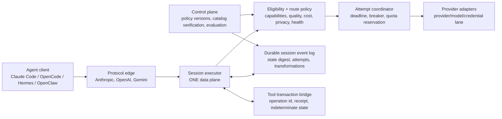

# LLM Circuit Breaker: critical review and state-of-the-art comparison

**Review date:** 2026-09-06
**Repository reviewed:** `d2epak/llm-circuit-breaker`, local checkout at commit `feb5cf1`
**Scope:** the complete Markdown corpus (37 Markdown files, 4,494 lines); every production Python module (7,263 lines under `src/llm_circuit_breaker`); the tests, benchmarks and examples that purport to validate it; the supplied external engineering brief; local test/benchmark execution; and current primary product documentation/research for comparable systems.

**Evidence standard:** this is a source-level engineering review, not a claim that every possible runtime interleaving has been formally proved. “Implemented” means code exists and was inspected; “integrated” means it is on the request path used by the HTTP proxy; “validated” means an applicable local check was run. A passing mock test never becomes evidence of a real provider, agent-client, or external-tool guarantee merely because the scenario name says it does.

## Executive verdict

This repository has a genuinely promising and unusually well-articulated thesis: **LLM availability is not enough for an autonomous agent; a safe failover must preserve protocol semantics, task state, context budget, and tool-side-effect safety.** That is the right problem to solve for Claude Code, OpenCode, Hermes, OpenClaw, and long-running cognitive agents. Most current gateways are primarily request routers. They make a next request more likely to complete; they do not establish that an interrupted agent can safely continue its *work*.

The codebase contains several strong building blocks toward that thesis: a proper six-state breaker, normalized request/response IR, capability-aware candidate selection, a useful structured context reducer, strict tool schema validation, deterministic mock fault injection, and a clear attempt/failover record. Its documentation also correctly identifies the fundamental streaming trade-off rather than promising impossible transparent mid-stream recovery.

However, **it is not yet safe to present V3 as a seamless, production-grade agent-resilience gateway or as superior to every existing gateway.** The critical issue is integration: the user-facing local proxy follows the legacy `UniversalFailoverRouter` path, while the V3 `GatewayExecutor` contains most of the advertised semantic machinery. As a result, the advertised Claude/Hermes/OpenClaw proxy does not exercise the formal breaker, IR-driven V3 execution, response validator, tool ledger, security guards, or streaming modes. A second, equally important issue is that a gateway cannot by itself know whether an external tool really executed. The ledger is a useful local primitive, but it is not connected to a durable tool-execution protocol, so it cannot currently guarantee replay suppression.

The opportunity is therefore excellent, but the correct positioning today is:

> **A well-designed V3 prototype and research direction for agent-safe provider failover, with a strong deterministic test harness; not yet a complete production control plane or a transparently seamless agent continuation system.**

Closing the integration and semantic-transaction gaps would give this project a defensible niche that the large gateways do not make their primary focus.

## What the Markdown corpus says

The documentation is far more mature than a typical early gateway project. It is also internally split between historical baseline/planning material and current V3 claims. That distinction must be made explicit to avoid both overselling and unnecessarily discarding good work.

| Document group | Files reviewed | What it contributes | Review finding |
|---|---|---|---|
| Product promise and architecture | `README.md`, `ARCHITECTURE.md`, `SECURITY.md` | The product narrative, proxy quickstart, six-state FSM, IR, semantic failover, security posture | Coherent design narrative, but the README makes several shipped-product claims that are not true on the documented proxy path. |
| Long-horizon design contract | `LLM_CIRCUIT_BREAKER_V2_LONG_HORIZON_SPEC.md` | An excellent phased specification: formal breaker, requirements routing, protocol IR, tool safety, persistence, streaming, benchmarks, governance | This is the best source of the project's intended end-state. It repeatedly warns against unmeasurable claims, a standard the public README should follow. |
| Operational behavior specs | `RELIABILITY_MODEL.md`, `FAILURE_TAXONOMY.md`, `ROUTING_POLICY.md`, `SEMANTIC_FAILOVER.md`, `CONTEXT_MODEL.md`, `TOOL_SAFETY.md`, `STREAMING.md`, `OPERATIONS.md` | Detailed expected semantics for resilience, routes, compaction, tools, streaming, telemetry and deployment | The desired behaviours are mostly sensible. Several describe a stronger system than the currently integrated runtime. |
| Decisions and process | `docs/adr/0001` through `0010`, `IMPLEMENTATION_PLAN.md`, `IMPLEMENTATION_LOG.md`, `MIGRATION_V1_TO_V2.md` | Rationale for key implementation choices and a credible migration plan | A real strength. The ADRs create an audit trail and make design trade-offs reviewable. Some ADR parameter names are stale. |
| Self-audits and evidence | `AUDIT_BASELINE.md`, `IMPLEMENTATION_BASELINE.md`, `GAP_REGISTER.md`, `CLAIM_AUDIT.md`, `FINAL_SELF_CRITIQUE.md`, `BENCHMARKS.md`, `results/*.md` | Historical audit, known gaps, critique and deterministic benchmark results | Refresh these documents against the current commit. Several correctly identified V2 gaps have code now, while new integration gaps are not recorded. Mock benchmarks are valuable regression tests, not external performance or SoTA proof. |
| Competition material | `COMPETITOR_MATRIX.md` | Positioning against LiteLLM, Cloudflare, Portkey, OpenRouter, Kong and Envoy | This needs a factual rewrite. It overstates competitors' limitations and understates their present routing, breaker, budget, observability and policy capabilities. |

### The documented product model

The documents converge on a good conceptual request lifecycle:

1. Accept a native Anthropic, OpenAI, or Gemini request.
2. Normalize it to an internal protocol IR.
3. Filter candidates by hard constraints: tools, context, privacy and cost.
4. Rank healthy candidates from telemetry and policy.
5. Execute with a bounded deadline, retry/fallback budgets and a circuit breaker.
6. Validate the result semantically, especially tool calls.
7. On migration, compact state and record an explainable `FailoverPlan`.
8. Return an appropriate native response/stream while avoiding duplicate tool effects.

For long-lived agents, this is materially better than treating every request as a stateless `POST`. The strongest ideas are the separation of infrastructure failures from semantic failures, an auditable migration record, and explicit acknowledgement that streaming creates an irreducible latency/failover/deduplication trade-off.

## Verified implementation state

### Evidence collected

The following checks were run locally on this checkout:

| Check | Result | Meaning |
|---|---:|---|
| `.venv/bin/pytest -q` | **84 passed** | The full local pytest suite exercises many V3 units and mocks. |
| `.venv/bin/python -m unittest discover -s tests -v` | **25 passed** | This is the command currently used by CI; it does not collect the `tests/unit/` V3 suite. |
| `.venv/bin/python -m llm_circuit_breaker.demo` | Passed with deterministic mocks | Good demonstration of the V3 executor's intended path; no real provider, agent, or tool process is involved. |
| `.venv/bin/python -m benchmarks.run` | 15/15 mock scenarios passed | Useful deterministic fault-regression suite; its sub-millisecond latencies are in-process mock timings. |
| README proxy command | **Fails** | `python -m llm_circuit_breaker.proxy.server --port 8000` fails because `proxy` is a module, not a package. |
| README SDK snippet using a default executor | **Fails** | The default capability registry has profiles but **zero endpoints**, producing `NoHealthyRouteError`. |
| `GatewayConfig().to_breaker_config()` | **Fails** | It passes an obsolete `wait_duration_in_open_seconds` argument rather than the implementation's `wait_duration_open_ms`. |
| Valid `ResponseValidator` call | **Fails** | It reads absent `NormalizedResponse.usage`; it should use `input_tokens`/`output_tokens` or introduce a valid usage object. |
| Large immutable root/system prompt compaction | **Violates budget** | The context manager returns a request far above the target budget when only protected content is large; it does not fail closed or produce a viable alternative plan. |

### The architectural split: the principal blocker

There are effectively two gateways in the repository:

| Path | Entry point | Capabilities actually used | Consequence |
|---|---|---|---|
| **Legacy compatibility/proxy path** | `proxy.py` -> `UniversalFailoverRouter` -> `pools.py` / pairwise translators | Static pool lists, round robin, per-pool cooldowns, simple pruning, synthetic SSE | This is what `/v1/messages` and `/v1/chat/completions` use today. It bypasses the V3 runtime. |
| **V3 execution path** | `GatewayExecutor` -> `CapabilityRouter` -> adapters | Breaker FSM, IR, failure classification, V3 context manager, tool validator, `FailoverPlan`, health score | This path is used by the demo and benchmarks after they programmatically create endpoint registries and mock adapters. It is not the documented drop-in proxy. |

This is directly visible in `src/llm_circuit_breaker/proxy.py:27,35,137-166`: the proxy instantiates `UniversalFailoverRouter(auto_discover_free=True)` and calls `ROUTER.dispatch()`. `GatewayExecutor` is not used. The V3 code has real value, but it cannot make the public proxy's behaviour true until there is one data plane.

The immediate engineering rule should be:

> There must be exactly one request execution path for the SDK, the HTTP proxy, and tests. Compatibility endpoints may translate at the edge, but they must then invoke the same V3 request/session executor.

### Feature truth table

| Capability | Design / documentation claim | Code status | Integrated into documented proxy? | Assessment |
|---|---|---:|---:|---|
| Six-state breaker | Count/time window, bounded half-open permits, admin states | Implemented in `breaker/` | No | Good in-process primitive. The proxy still relies on cooldowns. |
| Failure taxonomy | Separate infrastructure, quota, request, semantic and client conditions | Implemented | Partly/No | Valuable distinction, though rate-limit poisoning differs between documents and classifier behaviour. |
| Capability routing | Hard constraints plus telemetry scoring | Implemented | No | Better than round robin, but default profiles are optimistic and default endpoint list is empty. |
| Protocol IR | Anthropic/OpenAI/Gemini normalized IR | Implemented | No | Strong architecture; many provider extensions and protocol edge cases remain unverified. |
| `FailoverPlan` | Records semantic transformation and risk | Implemented | No | A useful audit record, but current plan omits actual state snapshot and transformations. |
| Context compaction | Strict budget fit while preserving protected state | Partly implemented | No | Structured extraction is promising; token estimate is heuristic and strict-fit invariant is false for oversized protected content. |
| Strict tool validation | Fails closed on missing/unknown arguments | Implemented | No | Strong safety primitive. It validates only a limited JSON Schema subset and allows type coercions that should be policy-controlled. |
| Tool idempotency | Prevents duplicate external effects | Primitive only | No | No dispatch/execution acknowledgement integration; cannot make the advertised guarantee. |
| Response validation | Rejects empty 200s and size bombs | Implemented but broken/unwired | No | Valid-result path raises `AttributeError`; executor duplicates some tool validation but does not use this validator. |
| Retry policy/backoff | Bounded exponential jitter and `Retry-After` | Calculation exists | No effective use | `compute_backoff_seconds()` is never invoked by the executor. A 429 test succeeds by immediately calling a mock again, not by waiting or queueing. |
| Streaming | True passthrough and atomic buffered modes | SSE synthesis types/helpers exist | Synthetic only | HTTP adapter reads an entire body and cannot parse/provider-pass-through SSE. No true streaming or atomic recovery implementation exists. |
| Persistent state | Optional SQLite breaker and tool receipt persistence | Storage class exists | No | It is not wired to breaker, health, ledger or proxy lifecycle. |
| Security guards | SSRF, CRLF, request/response limits and redaction | Helper functions exist | No | Neither V3 adapters nor legacy proxy apply the helpers. |
| Observability | Prometheus-style metrics and redacted structured logs | Basic JSON endpoint/helper exists | No | `/metrics` returns JSON rather than Prometheus exposition; structured logger is not integrated. |

## What is strong and worth preserving

### 1. The project has found a real unmet layer: agent continuity

The core distinction in `SEMANTIC_FAILOVER.md` is sound. A request gateway can retry an HTTP call; an **agent continuity gateway** needs to reason about protocol semantics, pending tool calls, session context and recovery policy. This is the clearest differentiator worth pursuing.

### 2. The circuit breaker model is much better than a plain cooldown

`CircuitBreaker` has explicit `CLOSED`, `OPEN`, `HALF_OPEN`, `FORCED_OPEN`, `DISABLED`, and `METRICS_ONLY` states. It uses a lock, a monotonic clock, sliding outcomes and bounded half-open permits. These are the right minimum mechanics for preventing a retry stampede. The unit tests cover the state machine and concurrent permit admission.

### 3. The IR reduces adapter complexity

The `NormalizedRequest`/`NormalizedResponse` model and first-party OpenAI, Anthropic and Gemini adapters are the right scaling shape: add one provider adapter rather than maintaining every client-to-provider pair. Preserving tool calls/results and reasoning fields in the model is a productive starting point.

### 4. The tool validator has a sound default posture

It refuses missing required arguments and unknown tools, and it limits repair to syntactic normalization. This is much safer than an LLM gateway inventing a `command` or silently deleting required semantics. The legacy `repair_json_string()` remains unsafe compatibility debt because it can synthesize structure; it should not exist on the production path.

### 5. Context compaction is intent-aware, not merely head truncation

The extractor retains selected JSON status fields, error lines, headings, tails and recent turns. It preserves a root/system prompt in tested cases. This is a useful heuristic that should evolve into an explicit, measurable context hand-off contract.

### 6. Documentation discipline is a competitive asset

The V2 long-horizon specification, ADRs, baseline audit and final critique make assumptions inspectable. `STREAMING.md` accurately states that a stream already written to the client cannot be transparently replaced without a client protocol. That intellectual honesty is rare and should guide the public claims.

### 7. Deterministic fault injection is a useful foundation

The programmable mock adapters, B1-B15 scenarios and compound semantic test make failures reproducible. They should stay in CI as a fast regression layer once the live proxy is unified with the executor.

## Critical weaknesses and why they matter to long-horizon agents

### P0 — V3 is not the product execution path

This is the first issue to fix. The proxy described as the route for Claude Code, Hermes and OpenClaw invokes a V1-style universal router rather than the V3 executor. Therefore claims in `README.md:48-62` about semantic failover are not assurances for the normal HTTP integration.

**Effect on the mission:** a user can configure `ANTHROPIC_BASE_URL` or `OPENAI_BASE_URL` and believe they are protected by schema validation, the breaker and a `FailoverPlan`, when they are actually using round robin, cooldowns and synthetic responses.

**Required fix:** replace the global legacy router in `proxy.py` with a dependency-injected runtime configured around `GatewayExecutor`; translate inbound request -> IR -> session execution -> native response. Make the legacy router a separately labelled compatibility API until it is removed.

### P0 — Tool idempotency cannot be guaranteed at the gateway boundary

The tool ledger tracks calls that the model *proposes*. It does not execute the tool, does not receive a durable acknowledgement from Claude Code/Hermes/OpenClaw, and `GatewayExecutor` never calls `mark_submitted()` or `mark_committed()`. The compound benchmark manually commits a receipt **after** the executor returns, which proves the ledger map works but not that the gateway prevented an effect.

There is a hard distributed-systems limitation here: if a tool process executes an action and the acknowledgement is lost, a retry cannot know whether it happened without a shared idempotency key and a durable participant/receipt. “Exactly once” is not a gateway property; it requires a contract with each tool runner.

**Required fix:** define an Agent Continuation Protocol (ACP) or MCP-adjacent extension:

- Every action has a stable `operation_id`, scope and request/session epoch.
- The gateway persists `prepared -> dispatched -> committed | indeterminate` atomically before/after dispatch.
- The tool runner accepts the operation id as an idempotency key and exposes `GET operation/{id}` or returns a signed durable receipt.
- On an ambiguous result, the default is **do not replay the tool**. Resume with an explicit `indeterminate` receipt and recovery instruction, unless the runner proves the action is absent/idempotent.
- Partition read-only, idempotent-write, compensatable-write and non-compensatable tools; only the first two may receive automatic replay under an explicit policy.

Until then, call the existing component a **tool-call deduplication ledger**, not an idempotency guarantee for external side effects.

### P0 — Broken or misleading onboarding

The documented proxy command (`README.md:141-142`) is invalid because `llm_circuit_breaker.proxy` is a single module. Use `llm-proxy --port 8000` or `python -m llm_circuit_breaker.proxy --port 8000`, then test it in CI. The default SDK snippet (`README.md:124-136`) also lacks endpoint configuration, while `CapabilityRegistry` seeds profiles only; its endpoint collection is empty. `GatewayConfig.to_breaker_config()` fails due to a stale parameter name (`config.py:37-43`).

**Effect on the mission:** one-command integration is essential for users rate-limited mid-workflow. If first use fails, they will stay with mature gateways.

### P0 — The strict context-fit contract is false in an important edge case

`ContextManager.compact()` promises to fit “strictly within” budget, but after protecting a very large system/root message it returns a still-oversized request (`agent/context.py:139-195`). This can lead to the exact context-overflow retry loop the product aims to solve. The char/4 token approximation also does not account for each provider's tokenizer, tool-schema tokens, hidden reasoning tokens or wire-level framing.

**Required fix:** make the compactor return a typed result: `FIT`, `COMPACTED_FIT`, `CANNOT_FIT_PRESERVED_STATE`, or `REQUIRES_SUMMARIZATION`. Refuse dispatch on the latter two unless an explicitly trusted summarizer creates a new, versioned semantic checkpoint. Use provider tokenizers where available and an empirically calibrated conservative estimator otherwise. Enforce both input and output caps before dispatch.

### P0 — Response validation and the advertised security controls are not operational

`ResponseValidator.validate()` accesses `response.usage`, but the IR response has `input_tokens` and `output_tokens`; a normal non-empty result raises at `validation/response.py:86-88`. The executor does not use `ResponseValidator` at all. Similarly, SSRF validation, header sanitation, payload limits, structured logging and SQLite persistence are standalone helpers/classes, not gates around proxy/adapters. The legacy proxy reads `Content-Length` without a limit and sends unvalidated configured upstream URLs.

**Required fix:** centralize the following in the only execution pipeline: request limit before parsing; endpoint allowlist/DNS/IP validation before connect; sanitized headers; bounded response/stream bytes; response validation before success; redacted structured events; then persistent ledger state. Add negative end-to-end tests through the real HTTP proxy.

### P1 — Rate-limit intelligence and fairness are not yet real

The documentation describes `Retry-After`, exponential backoff, cooldowns and isolated pools. In V3, the retry-policy calculator is not invoked and the router does not filter health snapshots in cooldown/quota exhaustion. The classifier currently marks 429s as health-poisoning, while `FAILURE_TAXONOMY.md` says rate limits do not poison the breaker. Breakers are keyed as `provider:model`, not `pool:provider:model` or credential/deployment/quota bucket, so V3 pool isolation can leak across agent classes.

The legacy pool manager has the opposite but also unsafe behaviour: when all routes are cooled down it deletes the oldest cooldown and tries it again. That converts a deliberate protection into a potential hammering loop.

**Required fix:** model the resource being rate limited as `(provider, deployment, model, credential/quota bucket, region)`. Track real server hints and client-side token/concurrency reservations. Queue or immediately choose another feasible candidate; never “solve” an empty pool by reopening a known-bad route. Use weighted fair scheduling across sessions so an aggressive coding agent cannot starve background agents sharing a key.

### P1 — "Pick the best LLM for any task" needs a quality model, not only health scoring

The present score mostly combines historical availability, latency, declared price and a static capability bonus. It cannot infer whether a model is suitable for a repository-specific coding step, a legal analysis, a high-stakes cognitive task, or a given tool protocol. Unknown profiles optimistically default to tool and streaming support, which is unsafe. Capability details are also provider/model version dependent and must expire.

**Required fix:** separate **eligibility**, **expected task quality**, **availability**, **cost**, **latency** and **risk**. Start with user-configurable task classes and calibrated policy tiers. Then add a learned quality/complexity router trained and evaluated on task-family outcomes, with shadow mode and an abstain/escalate-to-strong-model option. Do not let live routing self-train from unverified task success or silently drift.

### P1 — Long-horizon state has no durable, shared session model

`AgentState`, `StateSnapshot`, breaker/health maps, registries and ledgers are local process objects. The SQLite store is not connected. This does not survive a proxy restart, coordinate multiple proxy instances, or provide a session lease/fencing protocol. It also does not tie a client continuation (the next agent turn) to the precise failover plan that produced it.

**Required fix:** create a durable session/event log with optimistic versioning or leases. Store session id, turn id, state digest, selected endpoint, attempt chain, context transformation, tool operation ids and policy version. Use a shared strongly consistent or fenced store for the decision path where duplicate tool effects are possible; a local SQLite sidecar may be an acceptable single-host mode but must be advertised as such.

### P1 — Streaming is documented honestly but not implemented as documented

`streaming/modes.py` creates synthetic SSE from a fully available response. `BaseHTTPAdapter` uses `urlopen(...).read()`, so it cannot support upstream token passthrough, per-chunk idle/TTFT enforcement, incremental tool parsing, first-byte hand-off or atomic buffered streaming with fallback. The proxy always produces synthetic streams from completed legacy responses.

**Required fix:** choose explicit contracts:

- **Atomic mode:** buffer a bounded response, validate it, and only then produce synthetically paced SSE. This can guarantee one coherent response but has completion-time TTFT and needs admission/memory controls.
- **Pass-through mode:** forward only protocol-compatible events; after the first externally visible byte, emit a terminal `interrupted` event with `continuation_id`. Do not silently append a new model's text.
- **Resumable mode (future):** only for clients that opt into a semantic continuation protocol. The next event is a new turn/attempt, not an indistinguishable continuation.

### P1 — Benchmarking proves regressions, not the public conclusion

The B1-B15 harness is deterministic but all upstreams are local `ProgrammableMockAdapter`s. The “mid-stream reset” is a single synthetic 502, context inputs are much smaller than their descriptions suggest, and the primary research benchmark manually commits the tool receipt. The measured `<1 ms` failover latency contains no DNS, TLS, provider queueing, actual streaming, real tokenization or agent/tool process. Its baselines are in-repo toy policies, not LiteLLM, Portkey, Cloudflare or OpenRouter deployments.

The correct publication language is: **“100% completion on a controlled deterministic mock fault suite at this revision.”** It is not evidence of provider-independent production completion, semantic accuracy, or SoTA latency.

### P2 — Security and privacy claims require convergence with code

`SECURITY.md` promises “zero phone-home,” but importing the package imports `proxy.py`, which constructs `UniversalFailoverRouter(auto_discover_free=True)` and attempts OpenRouter discovery. The observed local command output was a failed catalog lookup even for unrelated imports. The legacy key loader also scans several user dotfiles. Both may be reasonable opt-in conveniences, but neither is zero phone-home nor least surprise.

**Required fix:** no network I/O or home-directory credential scanning at import. Discovery should be explicit, enabled by configuration, scoped to an allowlisted catalog URL, cached visibly, and disabled by default in an agent sidecar. Security documentation should distinguish local/private upstream support from SSRF defence, and describe the actual default payload limits.

### P2 — Documentation currently outruns the implementation

The existing self-critique usefully mentions some limitations, but the public matrix currently says, for example, that Portkey lacks a circuit breaker and budget capabilities and Cloudflare lacks dynamic policy-like routing. Their current primary docs say otherwise. Likewise “Resilience4j parity,” “tool execution idempotency,” “SQLite persistence,” “Prometheus metrics,” `<15ms overhead`, and “ironclad” should be retired or carefully qualified until verified through the real integration path.

## Current state of the art

The comparison below is based on current primary product documentation and the RouteLLM paper, not vendor marketing summaries in this repository. A blank/qualified field means the reviewed source does not establish the behaviour; it is not a claim that the competitor can never do it.

| System / approach | Present strength | Where LLM Circuit Breaker can differentiate | What it must match or exceed |
|---|---|---|---|
| **LiteLLM Proxy** | Broad provider abstraction and mature operational routing. Its current docs support per-key/team routing settings, including strategy, fallbacks, retries, timeouts and cooldown/allowed-failure settings. | Make an agent session and semantic hand-off first-class rather than treating all requests as generic API traffic. | Breadth of provider support, config ergonomics, production auth/governance, per-tenant policy, stable proxy compatibility and adoption. |
| **Portkey / PRISMA AIRS gateway** | Current docs advertise a universal API, MCP support, cross-model/provider fallback, per-strategy circuit breaker, retries, load balancing across keys, canaries, budgets, rate limits, Prometheus and self-hosting. Fallback targets are composable with conditional/load-balance strategies. | Offer verifiable continuation safety after a model switch: explicit state snapshot, transformation record, tool operation state and client protocol. | It is inaccurate to market Portkey as only a raw forward proxy. Match its policy composition, budgets, rate limits, tracing and configuration versioning. |
| **Cloudflare AI Gateway** | Dynamic routes are versioned flows with conditional, percentage, rate-limit and budget nodes plus provider fallbacks. Its fallback records the successful step, and its multi-provider edge control plane has strong global operational leverage. | A local, self-hosted, agent-runtime-aware system can preserve privacy/control and provide agent semantic continuity rather than edge request flow only. | Per-user/team limits, route versioning/rollback, observability, security controls, configuration lifecycle and robust provider integration. |
| **OpenRouter** | It has a large managed provider/model marketplace, provider-level load balancing/fallbacks, cross-model fallbacks, BYOK selection, parameter capability requirements, and current latency/throughput/price routing controls. | Operate independently of an aggregator and build a durable agent continuity plane that can span direct provider credentials and local models. | Its routing is already sophisticated. It is not sufficient to describe it as static retry. Also design for the fact an aggregator is a shared failure domain. |
| **RouteLLM and learned-routing research** | RouteLLM frames routing as an expected quality/cost decision, using learned routers and preference data rather than a static price/latency score. | Combine task-quality selection with availability/failover and a session-continuity contract; this is a strong research/product intersection. | Establish an offline benchmark, calibrated quality estimator, abstention, policy constraints and evidence that a route maintains task quality. |
| **LLM Circuit Breaker, current code** | Best conceptual focus in this set on the failure boundary between inference output and an autonomous agent's tools/state. The V3 building blocks are open, inspectable and compact. | This is the niche to own: **agent-continuation reliability**, not a generic “best router.” | First unite the implementation and prove that design under real provider, agent-client, context and tool failures. |

### What this comparison means

Existing gateways have substantially raised the floor. Cross-provider fallbacks, retry policies, costs/budgets, route conditions, multi-key load balancing, tracing and limited circuit protection are no longer unique. A product that competes only on “switch when a provider returns 429/503” will be difficult to distinguish.

The durable wedge is stronger and narrower:

> **Given a long-running, tool-using agent session, continue safely across a failure domain with an explicit proof of what was preserved, what was transformed, which actions are committed/indeterminate, and what the client must do next.**

That is not guaranteed by a universal OpenAI-compatible endpoint. It needs a continuation contract, persistent state and co-operation from the agent/tool executor.

## A credible world-class architecture

### Separate the data plane from the policy/control plane

The HTTP proxy should be a thin protocol edge. It should not own an independent routing algorithm or implicit global singletons. The session executor must produce a durable attempt record and a `FailoverPlan` on every migration.

### Use a four-level fallback ladder

Do not jump indiscriminately between models. Attempt the least semantically disruptive recovery first, respecting the total deadline and policy:

1. **Same deployment / same model / different credential lane** — a key-specific or local quota event should not discard model continuity.
2. **Same model / different provider** — only when provider capability and request parameters are confirmed compatible.
3. **Equivalent model family or policy tier** — requires protocol translation, capability proof, context re-budgeting and a recorded degradation decision.
4. **Deliberate degraded or paused continuation** — preserve session state and return an actionable continuation record rather than force a weak/untrusted model into a critical action.

The last option is vital. “Work must go on” should mean *the task state survives and recovery is automated where safe*, not “an arbitrary model silently performs a destructive next step.”

### Make candidate selection a constrained decision, not an opaque score

For each endpoint lane, evaluate in this order:

1. **Hard eligibility:** required protocol, multimodal parts, tool dialect, JSON schema subset, context + output fit, geography/data-retention constraints, user allow/deny list, credential availability, explicit budget cap.
2. **Session safety:** compatible tool runner/receipt contract, state transformation risk, allowed degradation tier, active circuit/lease/quota reservation.
3. **Expected utility:** calibrated task-family quality, probability of completion within deadline, expected cost, TTFT/throughput, recovery cost and exploration value.
4. **Explainability:** persist all candidates, exclusions, metrics freshness, policy version and the selected route.

The score must never cause a hard-ineligible provider to win. The routing explanation must distinguish measured values from cold-start defaults.

### Treat context as a versioned checkpoint

For long horizon coding/cognitive sessions, retain a provider-neutral checkpoint in addition to raw transcript:

- root objective and non-negotiable constraints;
- current plan, completed milestones and unresolved decisions;
- repository/workspace identity, file revisions and test outcomes;
- tool catalog, operation receipts and known side effects;
- essential conversation references and a digest of the source range;
- source-token budget, target-token budget, tokenizer/estimator version and fidelity risks.

The compactor should emit this checkpoint plus a human/auditable transformation report. A policy may permit lossless extraction, trusted summarization, or an explicit pause. It must never falsely label an oversized result as fitting.

### Capability data must be verified and time-bounded

Model capabilities change frequently. Use signed/configured catalog sources, versioned profiles, last-verified timestamps, active probes and a safe `UNKNOWN` state. “Supports tools” should mean a particular schema/tool mode has a passing contract test for the target provider/model version, not an optimistic default.

### Multi-process high availability comes after correctness

For a single local sidecar, SQLite WAL may be an acceptable durable mode if it is connected to the actual executor. For a fleet, breakers/quotas/session leases need a shared store and fencing tokens. Avoid globally opening/closing a whole provider on a one-key rate limit. Partition health by the actual resource and make policy boundaries configurable.

## Delivery plan and release gates

### Phase 0: stop misleading integration failures

1. Make `llm-proxy`/`python -m llm_circuit_breaker.proxy` the only documented command, or make `proxy` a package matching the current README.
2. Fix `GatewayConfig.to_breaker_config()` and add a smoke test for every README command/snippet.
3. Require explicit endpoint configuration or ship a safe configuration loader that creates V3 endpoints from the user's declared providers; never silently discover at import.
4. Remove import-time network I/O and home-dotfile scanning. Make catalog discovery explicit opt-in.
5. Switch CI to `pytest -q` (or make all intended unit directories discoverable) and add coverage/contract-test gates.

**Exit gate:** fresh environment install, config, SDK request and both HTTP endpoints work without network discovery; the proxy invokes `GatewayExecutor`; all routes have a test that proves this.

### Phase 1: make safe execution real

1. Integrate validation, security, limits, structured logging and persistent session/attempt records into the unified executor.
2. Implement actual retry waiting/queueing, quota reservations, `Retry-After` behaviour and circuit keys that include pool/deployment/credential scope.
3. Repair the strict context contract and add tokenization/provider preflight tests.
4. Design the external tool operation/receipt protocol; do not claim side-effect idempotency before it is available.
5. Implement honest streaming modes and client-visible interruption/continuation semantics.

**Exit gate:** fault injection flows through the actual HTTP proxy, and each safety feature has an end-to-end negative test—not only a helper-class test.

### Phase 2: prove cross-provider agent continuity

1. Contract-test Anthropic, OpenAI and Gemini request/response/tool conversions against recorded provider fixtures and current SDK/client versions.
2. Create adapters/integration suites for the explicitly supported clients: Claude Code, OpenCode, Hermes and OpenClaw. Test long-context coding loops and tool failures, not merely one request.
3. Add a durable session replay test: kill/restart a sidecar mid-turn, resume with the same session/operation id, and verify the safe terminal state.
4. Add privacy, provider-policy and user-consent controls for cross-provider data movement.

**Exit gate:** publish a compatibility matrix with exact client version, provider/model version, supported tool semantics, streaming contract and known limitations.

### Phase 3: earn “best model for this task” claims

1. Build a versioned evaluation corpus with coding, browser/tool use, multi-turn reasoning, structured output and long-context continuation tasks.
2. Compare against configured LiteLLM, Portkey, Cloudflare/OpenRouter flows where licensing and APIs permit; otherwise compare against transparent policy baselines, not straw men.
3. Measure task success judged independently, semantic/state fidelity, duplicate/indeterminate tools, time-to-recover, rate-limit compliance, p95 end-to-end latency, cost and privacy-policy violations.
4. Run a learned quality router in shadow mode, calibrate it per task class, and use a confidence threshold that escalates rather than gambling.

**Exit gate:** claims include confidence intervals, workload/hardware/provider details, exact baseline configuration, incident exclusions and raw artifacts. Do not quote in-process mock microseconds as gateway latency.

## Claims to keep, change and avoid

| Keep or adopt | Change now | Avoid until independently demonstrated |
|---|---|---|
| “Designed for agent-resilience and semantic failover.” | “Provides building blocks for semantic failover; the V3 executor is not yet the documented HTTP proxy execution path.” | “World’s best”, “zero downtime”, “seamless” without a defined client contract. |
| “Formal six-state circuit-breaker component with bounded half-open probes.” | “Deterministic mock fault suite” instead of “authoritative benchmark.” | “Resilience4j parity” as a blanket claim; parity requires systematic semantic/API/concurrency comparison. |
| “Fails closed on invalid tool schema in the V3 executor.” | “Tool-call ledger” until external execution receipts are integrated. | “Prevents duplicate side effects” or exactly-once execution. |
| “Explicit streaming trade-offs.” | “Synthetic streaming from completed responses” for the current proxy. | “True streaming” or “mid-stream transparent failover.” |
| “Self-hostable, zero required core Python dependencies.” | “Optional persistence/security helpers exist; integration status is documented.” | “Prometheus metrics”, “SSRF hardened”, “zero phone-home”, `<15 ms overhead` without end-to-end proof. |

## Recommended metrics for the product dashboard

Availability alone is inadequate. Track these per session, agent class, endpoint lane and policy version:

- request and **task/turn** completion rate;
- time to first useful token, time to usable complete turn and total recovery time;
- fallback depth/reason, breaker admissions/denials, and rate-limit compliance;
- state-checkpoint fidelity and context transformation risk;
- tool calls proposed, validated, dispatched, committed, indeterminate and replay-blocked;
- duplicate-effect incidents (must be zero for supported transaction classes);
- route quality regret versus a strong-model control, cost and budget adherence;
- provider/model/capability contract failures and catalog staleness;
- policy/privacy violations and cross-provider data-transfer events.

The operator must be able to answer after an incident: **what model handled which turn, what state changed, what the next model received, which tool actions are definitely committed, and whether any action needs human resolution?** That is the operational definition of safe agent continuity.

## Adversarial review of the supplied engineering brief

The supplied brief is materially better than a conventional feature checklist. Its insistence on forensics before implementation, explicit failure/resource/capability models, durable tool states, fair baselines, claim discipline, and a final red-team gate is exactly the posture this project needs. In particular, it correctly rejects a common gateway fallacy: a 200 response, a green unit test, or a component with the right name is not proof that the user-facing data plane is safe.

### What the brief gets right

| Brief principle | Why it is essential here | Present evidence |
|---|---|---|
| **Trace claims through real control flow** | It exposes the decisive V1-proxy/V3-executor split rather than rewarding isolated helpers. | Confirmed: `proxy.py` dispatches to `UniversalFailoverRouter`, not `GatewayExecutor`. |
| **Separate provider, quota, protocol and semantic failure** | A 429 for one credential must not be treated like a malformed tool call or a global provider outage. | The taxonomy/IR are a good foundation, though code and docs disagree on 429 breaker poisoning. |
| **Model the resource actually failing** | Safe retry depends on deployment, credential, region and quota bucket—not just a model name. | `Endpoint.resource_key` has the right shape; the executor uses only `provider:model`. |
| **Make side-effect ambiguity a first-class terminal state** | “Executed but response lost” is the central hard case for agent continuation. | `AMBIGUOUS` exists in the ledger but no external tool protocol can cause or resolve it. |
| **Evaluate task trajectories, not request microbenchmarks** | A long coding run can fail because one wrongly downgraded turn poisoned the whole trajectory. | Current B1–B15 are useful mock regressions but do not establish trajectory success. |
| **Require evidence and fair baselines** | This prevents the competitor matrix from mistaking old product knowledge for present reality. | The brief's standard is correct; the current competition and benchmark claims do not meet it yet. |

### Important omissions and assumptions to correct before treating the brief as a build contract

The brief is strong, but it is not yet sufficient by itself. The following additions are necessary; otherwise a team can satisfy many numbered phases and still create an unsafe or unadoptable gateway.

1. **State ownership and client contract are underspecified.** A gateway cannot reconstruct a Claude Code, Hermes, OpenClaw, or arbitrary agent's root objective, pending interaction, local filesystem state, and tool semantics from a transcript alone. Define an opt-in Agent Continuation Protocol (ACP): session/turn/epoch identifiers, a checkpoint digest, declared tool states, client acknowledgement, and a versioned recovery event. Existing OpenAI-/Anthropic-compatible HTTP should remain best-effort request routing, not be represented as guaranteed semantic continuation.
2. **“Exactly once” needs an end-to-end transaction boundary.** The brief identifies the ambiguity but must explicitly require a participant contract: stable operation ID, prepare/dispatch record persisted before send, idempotency-key acceptance by the tool runner, durable/signed receipt lookup, fencing/lease behavior, and an `indeterminate` default that blocks replay. For arbitrary shell, browser, database, or human tools, the honest guarantee is at-least-once, at-most-once, or manual resolution depending on the tool—not exactly-once.
3. **A threat model must precede security controls.** Add trust boundaries for local clients, remote tenants, administrator APIs, provider credentials, model content, tool results, provider egress, persisted transcript/trace, and model catalog. Then specify authn/authz, tenant isolation, TLS, secret rotation, SSRF DNS/IP rebinding defence, prompt/tool-output injection, log redaction/retention, data residency, and abuse/admission controls. Helpers alone do not create this posture.
4. **Availability requires overload and lifecycle design.** Add bounded queues, backpressure, cancellation propagation, client disconnect handling, server shutdown/drain, response-memory limits, circuit probe cancellation, per-tenant fairness, scheduler starvation tests, and an SLO/error-budget policy. Otherwise the gateway may stay available only by accumulating blocked threads and unbounded buffers.
5. **Provider compatibility must be contractual and versioned.** Model/version/catalog capability data needs provenance, expiry, active probing, provider API versions and preview-feature flags. Every protocol transformation needs a declared fidelity level (`lossless`, `lossy-but-consented`, `unsupported`) and conformance fixtures. This is particularly important for reasoning content, tool IDs, JSON Schema dialects, prompt caching, streaming events and usage/cost fields.
6. **“Best model” requires a product objective, not only an algorithm.** Add user policy and consent for task class, quality floor, latency/cost/privacy bounds, degradation tiers, regional/data-use restrictions, and forbidden providers. A learned router should be shadow-evaluated with held-out data; it must abstain or use the high-quality tier when confidence is low. Do not self-train from a model declaring success.
7. **The SoTA claim must be slice-specific.** “Beat LiteLLM, Portkey, etc.” is not a measurable single assertion. The defensible target is: *on supported long-horizon agent clients and tool classes, preserve more task continuity under documented failures while matching a defined subset of gateway reliability/control-plane capabilities*. Each competitor comparison must name version, deployment, configuration, workload, measurement and confidence interval.

### Current compliance against the brief's phases

This matrix is deliberately conservative. **Partial** means a credible local primitive exists but not necessarily a durable, integrated production behavior.

| Brief area | Current status | Concrete reason |
|---|---|---|
| 0–3: forensic baseline, claims, engineering hygiene | **Partial** | Excellent written specs/ADRs and deterministic tests; CI runs 25 `unittest` tests, not the 84-test pytest/V3 suite, and public quickstarts fail. |
| 4–8: breaker, taxonomy, resource and capabilities | **Partial** | Six-state breaker is real; resource identity/capability structures exist; proxy uses legacy cooldowns and V3 breaker keys omit deployment/credential quota scope. |
| 9–15: requirements, routing, health, retry and deadline | **Partial** | V3 hard constraints and score exist, but no endpoint defaults; health cooldown/quota is not a selection filter; retry backoff is calculated but not used. |
| 16–19: IR and protocol conformance | **Partial** | Basic OpenAI/Anthropic/Gemini transforms exist; no comprehensive recorded/live conformance suite, and the proxy uses older pairwise translation. |
| 20–23: tool validation, idempotency and agent state | **Partial / not proven** | Strict schema validation is promising; in-memory ledger/state does not participate in external tool dispatch or restart recovery. |
| 24–27: semantic state, context and streaming | **Partial / failed invariant** | `FailoverPlan` and compaction exist; the compactor can exceed its own budget and streaming is synthetic after complete buffering. |
| 28–33: rate limit, cross-agent fairness, cost, discovery, response checks | **Mostly absent in data plane** | No reservations/fair scheduler/cost enforcement; discovery is implicit at import; validator is broken/unwired. |
| 34–39: observability, security, concurrency, persistence, fault injection | **Partial** | Useful components and mock faults exist; logger/security/SQLite are unwired and no durable multi-process correctness is demonstrated. |
| 40–47: benchmarks, baselines, semantic invariants, statistics | **Early foundation** | Mock scenarios are deterministic; no real competitor baselines, statistical repeats, agent trajectory benchmark, or published raw evidence. |
| 48–64: API compatibility, documentation, self-review, load/acceptance gates | **Not met** | Compatibility is partial and proxy-only; docs overclaim actual behavior; no full red-team/load/production acceptance evidence. |

## Complete codebase audit

This section covers **every Python module currently in the repository**, including package glue, production code, test code, benchmark code and examples. It is intended to let a reviewer understand what each file contributes without treating its filename or unit test as proof that it is on the public request path.

### Package, legacy gateway and configuration

| File | What the code actually does | Critical assessment and required action |
|---|---|---|
| `src/llm_circuit_breaker/__init__.py` | Re-exports nearly the entire V1/V3 surface, including proxy. | The convenient facade creates a very large import surface; importing the package imports `proxy.py`, whose global router can discover remotely. Export only safe types by default; keep server construction and discovery explicit. |
| `config.py` | Defines `GatewayConfig` and converts it to breaker configuration. | The conversion uses obsolete `wait_duration_in_open_seconds`, so `to_breaker_config()` raises. Fix the field mapping and add an import/config smoke test. |
| `demo.py` | Creates a controlled clock, mock endpoints/adapters and shows V3 failover. | A good deterministic demonstration of intended V3 semantics, but it is not an integration demo: it bypasses HTTP, real configuration, streaming, tool execution and persistence. Keep it as a unit-style tutorial and label it accordingly. |
| `discovery.py` | Fetches/caches OpenRouter's catalog, identifies free/tool/coding models and registers discovered routes. | Useful optional discovery logic, but it performs remote catalog behavior and writes a user-home cache. It must be explicit opt-in, allowlisted, TTL/versioned, authenticated where required, and never executed at import. “Free” must not mean suitable/safe for a critical agent turn. |
| `errors.py` | Defines typed gateway, breaker, routing, budget and schema exceptions. | Clean taxonomy foundation. Ensure every public HTTP/ACP error maps to a stable machine-readable error code, retry guidance and continuation ID; current paths often return ad-hoc JSON. |
| `models.py` | Defines failure categories, failover reasons, classifications and attempt records. | Good shared vocabulary, but it needs immutable event IDs, session/turn/epoch/policy version, request-state digests and explicit data-classification fields to become an audit record. |
| `pools.py` | Loads keys from environment and several home dotfiles; defines route data and isolated coding/agent pools with cooldown/quota flags. | Legacy pool isolation is useful. Silent dotfile secret scanning violates least surprise and creates an unclear credential boundary. Replace it with explicit named credential providers; do not clear a cooldown merely because every candidate is unavailable. |
| `pruner.py` | Performs approximate token estimation and drops/truncates Anthropic/OpenAI message history. | It is a simple legacy emergency pruner. It can lose tool/state semantics and is separate from V3 context management. Remove it from the primary route and retain it only as a clearly lossy compatibility policy. |
| `router.py` | Implements synchronous `urllib` upstream dispatch, classifies failures, applies route cooldowns/deprecation/output-cap clamping and tries up to eight legacy routes. | This is the live proxy data plane. It is valuable as a small fallback prototype but has no V3 breaker/IR/security/persistence/session semantics, mutates caller payload for output caps, retries synchronously, and reads whole responses. Replace its dispatch with the unified executor behind a transitional adapter. |
| `proxy.py` | Standard-library HTTP proxy and optional FastAPI app for Anthropic/OpenAI endpoints, health/models/metrics and synthetic SSE. | This is the public product path and its largest gap. It uses a global `UniversalFailoverRouter(auto_discover_free=True)`, unlimited request read, no auth, no V3 executor and synthetic non-resumable streams. Make it a thin edge over a dependency-injected runtime; add payload, auth, cancellation and E2E contract tests. |
| `translators.py` | Legacy pairwise conversion/repair functions for OpenAI, Gemini and Anthropic payloads. | Compatibility coverage is helpful, but `repair_json_string()` can invent `{command}`/`{text}` structure and schema cleaning drops constraints. That is unsuitable for tool safety. Consolidate all transformations around the IR and record/deny lossy translation. |

### Agent continuity, breaker and capability modules

| File | What the code actually does | Critical assessment and required action |
|---|---|---|
| `agent/__init__.py` | Re-exports agent state/context/tool validation types. | Harmless glue; retain only once import side effects are removed upstream. |
| `agent/context.py` | Estimates tokens, summarizes historical tool output, and compacts messages while protecting early/recent turns. | One of the best V3 components conceptually. It uses a character heuristic, does not include all wire/tokenizer costs, and returns an oversized request when protected content alone exceeds budget. Return a typed `CANNOT_FIT` result and block dispatch or create a versioned trusted summary. |
| `agent/failover_plan.py` | Defines a compact `FailoverPlan` record for endpoint migration/context compaction. | A useful explainability seed. Add session/turn/epoch, transformation digest, source/target capability differences, consent/degradation decision, tool operation states and persistence. |
| `agent/idempotency.py` | Provides in-memory tool-call records and `PROPOSED` through `COMMITTED`/`AMBIGUOUS` status transitions plus argument-hash receipt lookup. | Correctly names the hard states but cannot protect an external side effect: executor never dispatches/commits it and a restart loses it. Rename current promise to deduplication, persist it, and integrate an ACP tool-runner receipt protocol before making idempotency claims. |
| `agent/state.py` | Captures agent objective, constraints, plan, completed work, tool receipts and serializable snapshots. | Good data model but no lifecycle, integrity/digest, state extraction, conflict control, storage, client acknowledgement or proxy integration. Treat as a proposed checkpoint schema, not preserved agent state. |
| `agent/tool_validation.py` | Parses/normalizes JSON, checks tool name, required/additional properties and a limited type subset. | Strong fail-closed default and safe syntactic repairs. It is not full JSON Schema, optional numeric coercion may be unsafe for some tools, and no tool-policy/authorization layer exists. Use a standards validator with an explicit approved-coercion policy and apply it on the sole execution path. |
| `breaker/__init__.py` | Re-exports breaker types and registry. | Simple glue. |
| `breaker/circuit_breaker.py` | Thread-safe six-state breaker with count/time metrics, slow calls and bounded half-open permits. | The most production-ready primitive. A hanging half-open probe can hold a permit beyond its logical window, and the close-transition reason logs zero successes after reset. Couple permits to cancellation/deadlines and use `Endpoint.resource_key`/durable coordination where needed. |
| `breaker/metrics.py` | Maintains a sliding deque of call outcomes and computes failure/slow rates. | Correct and compact for local-process windows, but snapshot recomputation is O(window) and not the O(1)/bucketed behavior described in docs. Specify intended scale, test time-window boundaries, and use a bounded bucket/ring implementation if required. |
| `breaker/registry.py` | Thread-safe local registry keyed by caller string. | Good in-process ownership. It has no persistence/tenant scoping/cluster coordination; the executor's caller key is too coarse. |
| `breaker/state.py` | Defines states and transition event structure. | Useful explicit FSM vocabulary. Add event sequence/version and persist transition provenance for operational audit. |
| `capability/__init__.py` | Re-exports capability types. | Simple glue. |
| `capability/profile.py` | Defines model pricing, privacy, quota and endpoint records; `Endpoint.resource_key` includes provider/deployment/model/quota bucket. | The data model points toward the right architecture. Values are static claims unless catalog/probes verify them; quota bucket counters have no enforcement or concurrency control. Add provenance/expiry/schema-dialect/capability-test result and use resource key everywhere. |
| `capability/registry.py` | Stores profiles/endpoints and seeds a small built-in catalog. | Endpoint registration works, but defaults have zero endpoints, stale model names and an “unknown is tool/stream capable” optimistic fallback. Unknown capability must be ineligible for safety-critical requirements until verified. |

### Classification, routing, health and execution modules

| File | What the code actually does | Critical assessment and required action |
|---|---|---|
| `classifier.py` | Parses retry/output-cap hints and maps errors/statuses to failure classification. | Broad and useful taxonomy. It conflicts with `FAILURE_TAXONOMY.md` by marking 429 as health-poisoning; unknown errors are also overly influential. Define one normative policy and add contract fixtures for provider error bodies/headers. |
| `execution/__init__.py` | Re-exports deadline, ledger, policy and executor. | Simple glue. |
| `execution/deadline.py` | Uses a monotonic overall deadline and derives per-attempt time. | Correct local helper. It is not propagated through HTTP connect/read/stream/tool cancellation and needs queue/admission time accounting. |
| `execution/executor.py` | V3 loop: select endpoint, admit breaker, compact context, execute adapter, validate tool calls, update health/ledger and produce a `FailoverPlan`. | This is the intended core but not the proxy path. It does not call `ResponseValidator`, sleep/back off, enforce ledger cost/budget, check health cooldown/quota, pass `status_code` to telemetry failure, persist anything, or execute a tool. Breaker key ignores deployment/quota resource scope. Make this the sole state-machine executor and close every listed integration hole. |
| `execution/ledger.py` | Records attempts, route cycles, fallback counts, cost and failover plans. | Good per-request diagnostic container. It is ephemeral and cost is post-hoc/unenforced; expand it into append-only durable session attempt events and atomically reserve budget before dispatch. |
| `execution/policy.py` | Defines retry/fallback attempt limits and jittered backoff calculation. | Sensible policy container, but executor never invokes the backoff calculation. Add retry scheduling with `Retry-After`, deadline awareness, cancellation and per-resource concurrency/quota rules. |
| `health/__init__.py` | Re-exports telemetry store types. | Simple glue. |
| `health/telemetry.py` | Tracks per-endpoint availability, EMA latency/TTFT, error counters, tool/semantic metrics and cooldown/quota timestamps. | A promising schema. Router ignores cooldown/quota fields; executor omits `status_code` so 429/5xx breakdown counts are not populated; tool/semantic outcomes are never recorded. Integrate it into selection and persistence. |
| `routing/__init__.py` | Re-exports decision/requirements/router/scorer. | Simple glue. |
| `routing/decision.py` | Holds candidate evaluations and selection decision data. | Good explainability baseline. Include policy/catalog/version, hard requirement values, resource/credential lane, metrics freshness, score components (including quality) and state-fidelity/degradation risk. |
| `routing/requirements.py` | Expresses hard needs such as tools, context, vision, streaming, privacy and cost. | Correct separation of hard constraints from scoring. It needs exact tokenizer preflight, output bounds, JSON Schema/tool dialect, region/residency, provenance, user policy and explicit unknown capability semantics. |
| `routing/router.py` | Filters endpoints by requirements/breaker state and selects by priority/round-robin/latency/cost/reliability/balanced score. | Good readable pipeline. It neither filters telemetry cooldown/quota nor uses `Endpoint.resource_key`; cold starts score too optimistically and round-robin lacks fair/weighted reservations. Integrate health/resource availability and policy leases. |
| `routing/scorer.py` | Scores declared capability, observed health/latency and price. | Explainable starter score, not task-quality routing. “Quality” is only tool/reasoning/context bonuses and is not retained as a separate decision field; static pricing/optimistic cold-start can dominate. Add calibrated task-class quality estimates, confidence/abstention and user constraints. |

### Protocol, provider, streaming and operational modules

| File | What the code actually does | Critical assessment and required action |
|---|---|---|
| `protocol/__init__.py` | Re-exports IR and provider transforms. | Simple glue. |
| `protocol/ir.py` | Defines normalized messages, requests, responses, tool definitions/calls/results. | The right architectural center. Extend it with multimodal/prompt-cache/reasoning provenance, native IDs, raw semantic fidelity, protocol version, token usage buckets, continuation/session metadata and unknown-field preservation. |
| `protocol/openai.py` | Converts OpenAI chat requests/responses to/from IR. | Solid basic mapping, but malformed tool arguments become `{}` and modern/provider-specific fields need conformance coverage. Preserve raw arguments/unknown fields; test against current API fixtures and tool/stream edge cases. |
| `protocol/anthropic.py` | Converts Anthropic messages to/from IR. | Covers basic content/tools/thinking shape. Compatibility for extended thinking, prompt caching, citations, tool IDs, images, stop/error/stream events needs explicit, versioned contract tests. |
| `protocol/gemini.py` | Converts IR request to Gemini and Gemini response to IR. | Gives the V3 executor a third protocol, but has no reverse Gemini request parser and must be verified for roles, function/tool output and safety/candidate behavior. Treat unsupported constructs as explicit rather than approximate. |
| `providers/__init__.py` | Re-exports adapter interfaces/registry. | Simple glue. |
| `providers/base.py` | Defines prepared request/result and adapter protocol. | Clean seam for dependency injection/tests. Make it async/cancellation-aware or clearly define thread/process pool ownership; include streaming/event interfaces and credential/resource identity. |
| `providers/adapters.py` | Uses `urllib` to prepare/execute OpenAI-compatible, Anthropic and Gemini requests and normalize full JSON responses. | Functional synchronous base adapter, but it reads all bytes at once, lacks real SSE, connect/read/write timeout separation, DNS/URL protection, body limits, header sanitation, cancellation, retry classifications and redacted tracing. Implement secure async/streaming transport or deliberately offer bounded buffered mode only. |
| `streaming/__init__.py` | Re-exports streaming modes and synthesizers. | Simple glue. |
| `streaming/modes.py` | Defines mode/policy/metrics records and emits Anthropic/OpenAI-shaped SSE from a completed normalized response. | Honest building block for buffered synthetic output, not actual streaming/failover. Wire explicit atomic/pass-through/resumable contracts into transport and client behavior; never call it transparent recovery. |
| `validation/response.py` | Attempts empty/size/tool-call response validation. | It accesses nonexistent `NormalizedResponse.usage` on valid responses and is not called by the executor. Repair IR usage contract, invoke validator before success, and add real response limits/content-type/schema checks. |
| `security/defense.py` | Validates upstream URL strings, strips CR/LF headers and checks a payload-size limit. | Necessary helpers but insufficient and unwired. Default localhost allowance, regex-based metadata checks, no DNS resolution/rebinding defence, CR/LF stripping rather than rejection, 25 MB default and absent proxy enforcement are not production hardening. |
| `observability/logger.py` | Redacts common secret fields and emits structured JSON logs. | Good start, but it is not used in proxy/executor and can still receive unclassified prompts/tool outputs. Define structured event schema, central redaction/data-retention policy and metrics/traces correlation. |
| `storage/__init__.py` | Re-exports SQLite persistence. | Simple glue. |
| `storage/sqlite.py` | Persists breaker state, tool receipts and health in a local SQLite database. | Useful single-host seed, but no production lifecycle wiring, migrations, WAL/locking/retention/encryption/tenant isolation or atomic cross-record transaction. Wire it behind repository interfaces and document its single-host guarantees. |

### Tests, fault injection, benchmarks and examples

| File(s) | What the code actually validates | Critical assessment and required action |
|---|---|---|
| `tests/__init__.py`; `tests/test_classifier.py`; `test_discovery.py`; `test_output_cap.py`; `test_pools.py`; `test_proxy.py`; `test_pruner.py`; `test_router.py`; `test_translators.py` | Legacy units for parsing, discovery/pools, proxy payload behavior, pruning and pairwise translation. | They keep V1 behavior reproducible, but they do not prove V3 integration or safe public proxy behavior. The CI `unittest discover` sees this layer and misses `tests/unit/`; replace it with one explicit pytest collection. |
| `tests/faults/__init__.py`; `tests/faults/mock_provider.py`; `tests/faults/test_fault_injection.py` | Programmable mock provider faults and deterministic B1–B15-like failure cases. | Valuable fault-injection foundation. Add real HTTP server/proxy, cancellation, clock/queue, restart and provider-fixture layers; a mock cannot verify SDK/API contracts. |
| `tests/unit/test_agent_semantics.py` | Context/failover-plan/state behavior. | Good intent-level tests; add protected-overbudget failure and durable checkpoint/client-ack tests. |
| `tests/unit/test_circuit_breaker.py` | FSM, thresholds and half-open behavior. | Strong primitive coverage; add hanging probe cancellation, time-window/boundary, listener failure and resource-key integration. |
| `tests/unit/test_concurrency_load.py` | Local concurrency/permit and routing stress cases. | Useful initial contention testing, but no sustained load/backpressure/memory/fairness/multi-process result or SLO report. |
| `tests/unit/test_execution_policy.py` | Retry/fallback policy and executor mock behavior. | Catches policy calculations, but must assert actual wait/scheduling and `Retry-After` propagation once wired. |
| `tests/unit/test_persistence.py` | SQLite helper persistence. | Validates a helper, not a restarted gateway. Add crash/replay/migration/WAL/tenant and atomic tool-operation tests. |
| `tests/unit/test_protocol_ir.py` | Basic IR/provider translation. | Necessary but far below provider conformance. Add recorded native fixtures, property tests and differential tests against official SDK/client behavior. |
| `tests/unit/test_red_team.py` | Some security/unsafe-translation cases. | Good start; expand to malformed HTTP, DNS rebinding, header/body bounds, credential leakage, malicious tool output and multi-tenant abuse. |
| `tests/unit/test_routing_engine.py` | V3 candidate selection/scoring. | Covers local algorithmic choices; add quota/cooldown/resource-key, quality confidence, consent/degradation and decision-event assertions. |
| `tests/unit/test_security_and_validation.py` | Security helper and response/tool validation cases. | It did not expose the normal `ResponseValidator` success-path AttributeError. Add an integration test through the actual executor/proxy. |
| `tests/unit/test_streaming_and_providers.py` | Synthetic streaming and mock provider adapters. | Does not test upstream SSE, chunk/TTFT/idle failures or post-first-byte continuation rules. |
| `tests/unit/test_tool_idempotency.py`; `tests/unit/test_tool_validation.py` | Ledger state transitions and schema checks. | Correct local tests; no real side effect occurs. Add tool-runner contract tests with dropped acknowledgements and durable receipt resolution. |
| `benchmarks/harness.py`; `benchmarks/scenarios.py`; `benchmarks/run.py` | Runs 15 controlled mock scenarios and formats results. | Retain as a fast regression harness, but report “controlled mock completion,” not gateway latency/reliability. Add seeds, repetitions, CIs, raw traces and an explicit benchmark manifest. |
| `benchmarks/semantic_failover/__init__.py`; `benchmarks/semantic_failover/runner.py` | Demonstrates compound V3 semantic failover with manual ledger receipt commits. | It tests structures but not external tool execution. Remove manual post-hoc commits from any claim-bearing result and test a real ACP participant. |
| `examples/durable_runner.py` | Illustrates durable-runner/receipt concepts. | Useful design communication; it should become a tested reference ACP participant rather than an example-only promise. |
| `examples/openclaw_example.py` | Illustrates OpenClaw use/configuration. | Helpful onboarding draft, but it is not an integration contract. Make it executable in CI against a pinned supported client version and actual proxy configuration. |

### Findings that matter across the entire codebase

1. **There are two architectures, not one.** V1 is small, synchronous and integrated; V3 is more principled but isolated. Every new feature must land in the single execution path before it earns a public claim.
2. **Local in-memory data structures recur where the mission needs durable coordination.** This affects breaker state, health, session state, costs, tool receipts and route decisions. Decide explicitly which guarantees are single-sidecar versus clustered, then implement each with the appropriate transaction/lease boundary.
3. **The code has good nouns but incomplete verbs.** `QuotaBucket`, `FailoverPlan`, `AMBIGUOUS`, `StreamingMode`, security helpers and SQLite are useful concepts. The central question is whether the runtime writes/reads/enforces them at the right point in a real request. Today, many do not.
4. **The test suite is better than the CI signal.** The 84 passing pytest tests are a real asset, but the configured 25-test CI command creates an accidental lower bar. A green workflow is not a green V3 product until collection is unified and proxy E2E tests exercise the same executor.

## Research refresh: what “state of the art” now demands

The original comparison correctly identified learned routing and gateway fallbacks, but current research sharpens the evaluation bar. [LLMRouterBench](https://arxiv.org/abs/2601.07206) covers 400K+ instances, 21 datasets, 33 models and ten baselines; it reports that no model wins every domain and that leading router methods can have similar aggregate results. Its lesson is that a static “one scoring formula” will not establish best-in-class task selection. [TwinRouterBench](https://arxiv.org/abs/2605.18859) is even more directly relevant: it evaluates router-visible prefixes at intermediate long-horizon agent steps and uses dynamic SWE-bench Verified runs with realized API spend. A single wrong downgrade can invalidate a whole trajectory, so per-request success and cost are insufficient.

Operationally, competition is also broader than the first table alone conveys. [Bifrost's provider routing documentation](https://github.com/maximhq/bifrost/blob/dev/docs/providers/provider-routing.mdx) describes governance-based routing, adaptive real-time load balancing, key-level selection and a circuit-breaker mechanism; its [retry/fallback documentation](https://github.com/maximhq/bifrost/blob/dev/docs/features/retries-and-fallbacks.mdx) records retry/fallback transitions in a per-request routing log. This does not invalidate LLM Circuit Breaker's opportunity. It clarifies it: generic multi-key fallback, log trails and breaker behavior are table stakes. The project needs a more rigorous **agent-state and tool-continuity** guarantee than these request-gateway features, and it must demonstrate that guarantee with a client protocol and trajectory evaluation.

### Revised benchmark and claim target

To claim a new SoTA in a meaningful way, publish two separately versioned tracks:

| Track | Purpose | Minimum competitors/baselines | Success measure |
|---|---|---|---|
| **Router quality/cost** | Choose a sufficient model before a call. | Fixed high-tier; fixed low-tier; static heuristic; learned baseline such as RouteLLM-style policy; configured gateway policies where reproducible. | Held-out task/trajectory resolution, realized token/cache cost, latency and calibrated abstention—not just score. |
| **Agent continuity under failure** | Preserve a supported long-running agent turn when a lane fails. | No gateway; same-provider retry; LiteLLM/Portkey/Bifrost configured equivalents when terms/credentials permit; LCB with routing only; LCB with ACP. | Task resolution, checkpoint fidelity, time to recovery, rate-limit compliance, committed/indeterminate/replayed tool operations, privacy-policy violations and p95/p99 overhead. |

For every report freeze: repository commit, Python/runtime, exact client and provider/model/API versions, keys/region/configuration, scenario seeds, fault injector, endpoint availability, data-retention policy, number of independent runs, raw attempt traces, statistical intervals and excluded failures. A mock suite remains required—but only as the reproducible lower layer beneath this evidence.

## Detailed implementation plan to create a defensible SoTA

The order below deliberately makes the existing promise truthful before adding sophistication. Each milestone names the code boundary, data contract, tests and release gate; it can be implemented incrementally without a second permanent router.

### Milestone 1 — one safe data plane (P0)

**Goal:** make all HTTP protocols, SDK use and tests execute the V3 state machine, with no network/dotfile side effects at import.

1. Create `runtime.py` with a `GatewayRuntime` factory that receives explicit `CapabilityRegistry`, `GatewayExecutor`, credentials, policy and persistence. It must have no module-level network I/O.
2. Refactor `proxy.py` into protocol edge functions: parse bounded request, authenticate/authorize, convert native request to IR, obtain a `SessionContext`, call `runtime.execute_turn()`, convert the verified response/continuation event back to native protocol. Remove global `ROUTER`; make discovery an explicit CLI/config action.
3. Add an endpoint configuration loader (`config.py` or new `configuration.py`) that validates URL/credential references, constructs `Endpoint` instances and rejects an empty eligible pool before serving. Correct the breaker config field.
4. Keep `UniversalFailoverRouter` behind a deprecated explicit compatibility entry point only; do not allow the main proxy to instantiate it. Change `__init__.py` to avoid importing server/discovery modules by default.
5. Apply `validate_upstream_url`, strict header rejection, request/response bounds and `ResponseValidator` in the executor transport pipeline. Repair the IR usage model/validator before wiring it.

**Tests and gate:** fresh virtualenv install; every README command/snippet runs; real local HTTP tests prove Anthropic and OpenAI endpoints call a spy `GatewayExecutor`; empty/oversize/malicious request tests fail closed; `pytest -q` is the only CI test command. No import may touch the network or scan a home dotfile.

### Milestone 2 — durable session and tool continuation protocol (P0)

**Goal:** support an honest, scoped “work continues safely” contract for cooperating agents/tool runners.

1. Add `continuation/models.py` with immutable `SessionId`, `TurnId`, `Epoch`, `Checkpoint`, `ContinuationEvent`, `OperationId`, `ToolDispatch`, `ToolReceipt` and `IndeterminateOperation`; include schema/protocol versions, content digests and policy/catalog versions.
2. Add repository interfaces (`SessionStore`, `AttemptStore`, `OperationStore`, `LeaseStore`) and implement a transactional SQLite/WAL single-host backend first. Persist `prepared` before dispatch, state/attempt events append-only, and `submitted` before waiting for the tool acknowledgement. Make retention/encryption/tenant ownership explicit.
3. Define ACP over HTTP/MCP-adjacent JSON: the tool runner receives an idempotency key and session epoch, atomically deduplicates it, returns a signed/durable receipt, and exposes status lookup. On timeout after submission mark **indeterminate**; prohibit automatic replay unless the tool class/policy and status lookup prove it safe.
4. Integrate `AgentState` and `FailoverPlan` into `GatewayExecutor` as durable checkpoints. A raw OpenAI/Anthropic client without ACP receives an explicit best-effort response; a client that acknowledges ACP can resume from a continuation event after a crash/failover.
5. Define tool classes: read-only, idempotent write, compensatable write, non-compensatable write. Route/execute policy must make replay and human approval rules visible per class.

**Tests and gate:** kill/restart the process after prepare, after dispatch and after tool commit; run duplicate requests and dropped acknowledgements against a reference tool runner; assert no duplicate effects for supported idempotent classes and `indeterminate` for every ambiguous non-idempotent case. Document exact guarantees rather than using universal “exactly once.”

### Milestone 3 — resource-aware resilient transport and truthful streaming (P0/P1)

**Goal:** make rate-limit recovery, health and streams real rather than helper behavior.

1. Change breaker/router/health identities to `Endpoint.resource_key` plus tenant/pool where policy requires. Implement quota reservations and token/concurrency bucket admission keyed by provider/deployment/model/credential/region; honor `Retry-After` and headers, and never reopen a cooled route merely because the pool is empty.
2. Wire `RetryPolicy.compute_backoff_seconds()` into a cancellable deadline-aware scheduler. Split connect, TLS, first-byte, idle and total deadlines; propagate cancellation from client disconnect through adapter and tool dispatch.
3. Replace whole-body `urllib` behavior with an adapter transport interface supporting bounded buffered execution and true event streaming. Start with **atomic buffered** mode with admission/memory caps; then add protocol-compatible pass-through that emits `interrupted` plus a continuation ID after first visible byte. Do not silently splice a second model's text into an existing stream.
4. Make health updates complete: status-code counters, TTFT, semantic/tool outcomes, cooldown/quota routing exclusion, staleness and cold-start exploration budgets. Persist/aggregate metrics by resource and policy version.
5. Convert `/metrics` to Prometheus exposition or rename it as JSON diagnostics; add authenticated admin state transitions and an audit log.

**Tests and gate:** controllable clock/HTTP fixtures for 429 headers, 5xx, DNS/connection/first-byte/idle failures, cancelled streams and all-cooldown pools; load test bounded queue/memory/fairness; proven no request gets a supposedly continuous stream after a cross-model post-first-byte change.

### Milestone 4 — verified capability and quality policy (P1)

**Goal:** choose the best *eligible* model for a declared task while preserving privacy/safety constraints.

1. Expand `ModelProfile` with catalog provenance, verified-at/expiry, protocol/API version, exact tool/JSON Schema/streaming/multimodal support and tokenizer metadata. Unknown or stale capabilities fail hard requirements by default.
2. Build provider conformance fixtures for every supported model/protocol feature. Preserve unknown fields and raw tool args in IR; label transforms lossless/lossy/unsupported and require user policy consent for lossy moves.
3. Extend `RequirementVector` and `RoutingDecision` with task class, quality floor, residency/retention, budget, schema dialect, state-fidelity risk and user allow/deny policy. Make candidate exclusion and score components immutable audit events.
4. Split routing into eligibility, availability, task-quality estimate, expected cost/latency and degradation policy. Begin with explicit task-class policies and conservative tiered cascades. Train/introduce any learned router only in shadow mode with calibration/abstention and a high-tier fallback.
5. Account for full cost before dispatch (input/output reserve, cache reads/writes, retries and switch cost) and reconcile it against provider usage after completion; enforce session/tenant budgets rather than merely summing a ledger.

**Tests and gate:** contract tests against recorded current provider responses; fuzz/property tests for IR/schema translation; stale/unknown profile never receives unsupported tools; shadow routing report shows calibration, regret and task-class results before automatic downgrades are enabled.

### Milestone 5 — prove the differentiated product (P1/P2)

**Goal:** earn a narrow, evidence-backed SoTA claim and make it adoptable.

1. Ship maintained adapters/integration suites for a pinned support matrix: Claude Code, OpenCode, Hermes and OpenClaw. Each suite must exercise long context, tool calls, rate limit, partial response and restart/continuation behavior—not just configure a base URL.
2. Evaluate model selection on LLMRouterBench-style static workloads and agent routing on TwinRouterBench-style step/trajectory workloads. Add an internal continuity benchmark with controlled lane failure and ACP tool participants; publish scenario definitions and raw traces.
3. Run fair configured baselines: no gateway, same-provider retry, static cascade and—in reproducible/licensed environments—LiteLLM, Portkey, Bifrost, Cloudflare or OpenRouter. Do not create “baselines” by reimplementing competitors as toy routers.
4. Add security red team, chaos/fault injection, multi-process persistence, upgrade/migration, saturation and 24-hour soak gates. Use release blocker SLOs for recovery time, duplicate effects, indeterminate resolution, rate-limit compliance, privacy transfer and route-quality regressions.
5. Update README/competitor matrix only with claims whose test artifact is linked. Version policy/catalog/schema changes, expose decision/continuation inspectability, and publish known unsupported semantics prominently.

**Release gate:** for each advertised client/tool class, an independently rerunnable suite proves the stated continuation semantics across restart/failure; the benchmark reports confidence intervals and full configurations; external reviewers can reproduce a result without reading source to discover hidden assumptions.

## Source notes

External comparison was refreshed on 2026-09-06 from these primary sources:

- [LiteLLM: router settings by key and team](https://github.com/BerriAI/litellm-docs/blob/main/docs/proxy/keys_teams_router_settings.md) — per-key/team strategies, fallbacks, timeouts, retries and reliability settings.
- [Portkey / PRISMA AIRS AI Gateway](https://portkey.ai/docs/product/ai-gateway) and [fallback composition](https://portkey.ai/docs/product/ai-gateway/fallbacks) — universal API, MCP, breaker, retries, budgets, rate limits and composable routing.
- [Cloudflare AI Gateway dynamic routing](https://developers.cloudflare.com/ai-gateway/features/dynamic-routing/) and [fallbacks](https://developers.cloudflare.com/ai-gateway/configuration/fallbacks/) — versioned conditional flows, budget/rate-limit nodes and provider fallback step visibility.
- [OpenRouter provider routing](https://openrouter.ai/docs/guides/routing/provider-selection) and [model fallbacks](https://openrouter.ai/docs/guides/routing/model-fallbacks) — cross-model/provider routing, parameter requirements, BYOK and price/latency/throughput policies.
- [RouteLLM: Learning to Route LLMs with Preference Data](https://arxiv.org/abs/2406.18665) — the research framing for learned quality/cost routing.
- [Bifrost provider routing](https://github.com/maximhq/bifrost/blob/dev/docs/providers/provider-routing.mdx) and [retries/fallbacks](https://github.com/maximhq/bifrost/blob/dev/docs/features/retries-and-fallbacks.mdx) — current governance/adaptive routing, key-level circuit behavior, and request routing log trails.
- [LLMRouterBench](https://arxiv.org/abs/2601.07206) — a 2026 large-scale, unified routing benchmark with 400K+ instances, 21 datasets, 33 models and ten baselines.
- [TwinRouterBench](https://arxiv.org/abs/2605.18859) — a 2026 step-level and dynamic long-horizon agent-routing evaluation using router-visible prefixes, SWE-bench Verified resolution and realized spend.

The review intentionally does not infer unadvertised behaviour from any competitor. The comparison is about what must be true for LLM Circuit Breaker to earn a differentiated place in the current ecosystem.

## Bottom line

The repository should not aim to be a generic replacement for every gateway. It can aim higher and more defensibly: **the trustworthy continuation layer for tool-using, long-running agents when a provider/model/credential lane fails.**

The code and documents already contain the beginnings of that product. The next release needs to make the V3 executor the real gateway, introduce a durable agent/tool transaction contract, make context/streaming failure semantics truthful, and evaluate real long-horizon agent outcomes. After that, “provider rate limited, work continues safely” can be a powerful claim with evidence behind it.

## Implementation verification after the LLM2 review

**Verification date:** 2026-09-06
**Evidence window:** the LLM2 report, its remediation log and the actual checkout through `b9f840b`, plus the changes in this review update. The original analytical portions of both reviews describe `feb5cf1`; they are historical evidence, not a description of the current data plane.

### Overall result

LLM2 did substantially more than write a second critique. Its remediation commits implement the earlier Phase A–D work, including the essential proxy-to-`ProxyGateway`/`GatewayExecutor` consolidation. That invalidates the most important historical LLM1 finding—"the documented HTTP proxy bypasses V3"—for the current checkout. The new HTTP acceptance test independently demonstrates the new path with controlled adapters.

The LLM2 document nevertheless overstates item 31. Remote `origin/main` resolved to `4dde71e` for its V1-baseline commit, so the **V1 (`UniversalFailoverRouter`) baseline was committed and pushed**. The requested **LiteLLM Router baseline was absent**: the harness explicitly stated that LiteLLM was not a benchmark row. This update completes that missing half with an actual in-process `litellm.Router`, not a reimplementation with a LiteLLM-shaped name.

The screenshots' “115 unittest / 214 pytest” counts are also stale. Final local verification of this checkout reports **224 pytest tests**. `unittest discover` remains useful for compatibility but is no longer the CI source of truth.

### Item-by-item verification

| Item | Verified state | Evidence and limitation |
|---|---|---|
| 27–30 | Implemented before this update | The harness has one common success predicate, stateful mock tool runner, seeded multi-run reporting/provenance/intervals, and revised scenarios. These are credible deterministic regression artifacts, not external-provider performance evidence. |
| 31a: V1 baseline | Complete and already pushed | `Baseline-E-V1-Prototype` drives `UniversalFailoverRouter` through the mock provider adapters. Commit `4dde71e` is the remote main tip before this update. |
| 31b: LiteLLM baseline | Completed in this update | `Baseline-F-LiteLLM-Router` instantiates LiteLLM's own `Router` and `CustomLLM` seam. It uses a one-way primary-to-secondary fallback to avoid a synthetic A→B→A cycle. A focused test proves that the actual Router falls back from A to B. |
| 32: CI | Completed in this update | GitHub Actions now runs pytest with branch coverage, Ruff, strict MyPy on the breaker core, and `python -m build`. Ruff's safe automated cleanup fixed 121 pre-existing correctness/import issues; E501 remains explicitly exempt because long fixture/report literals are established project style. |
| 33: HTTP acceptance | Completed in this update | `tests/e2e/test_acceptance_scenario.py` drives the public OpenAI-compatible endpoint over loopback HTTP using mock adapters. It checks first success, two 503 failures, 90K-token history compaction into a 32K Gemini lane, accepted trailing-comma tool-JSON repair, OPEN skip, half-open recovery, transition events and attempt counts. |
| 34: external-document references | Completed by removal | The external engineering brief is not versioned in this repository. Rather than add an unverifiable attachment, every tracked repository reference to it was removed and the audit docs now point to the versioned V2 specification and repository evidence. Historical untracked review files are deliberately preserved as review evidence. |

### Code written or materially changed in this update

| File(s) | What changed | Assessment |
|---|---|---|
| `benchmarks/harness.py` | Adds `LiteLLMRouterRunner`, registering a temporary custom LiteLLM provider that delegates to the existing programmable adapters; adds the router as Baseline F. | This is a real LiteLLM control-flow baseline, including its fallback handling. It is still a hermetic mock-provider experiment: it does **not** measure LiteLLM with live credentials, a LiteLLM Proxy deployment, or customer traffic. Keep its configuration/version in every benchmark report. |
| `tests/test_benchmark_harness.py`, `tests/test_benchmark_run.py` | Adds a real-Router fallback assertion and updates the expected table row count from six to seven systems. | Good regression coverage for the otherwise easy-to-fake baseline. It should later assert LiteLLM's exact retry, timeout and cooldown configuration separately. |
| `src/llm_circuit_breaker/execution/executor.py` | Sends `raw_arguments` to the validator when a provider parser yielded `{}` from malformed JSON; on an accepted deterministic repair it returns canonical JSON while retaining the original in metadata. | Correct and important: without it, a safely repairable string silently became a missing-required-field error, and even a repair could be overwritten by raw malformed OpenAI arguments. This is validation/normalization, not tool execution or an exactly-once guarantee. |
| `tests/e2e/test_acceptance_scenario.py`, `tests/e2e/__init__.py` | Adds the ordered acceptance trajectory through the real local HTTP proxy. | The strongest current integration proof. It is intentionally single-process and uses a mock Gemini adapter, so it does not prove vendor wire conformance, restart recovery, or an external tool side effect. |
| `.github/workflows/ci.yml`, `pyproject.toml` | Adds dev dependencies and checks: pytest-cov, Ruff, MyPy, build and LiteLLM. Coverage is measured with branch mode and a 75% floor. | The 75% floor is honest relative to the measured 77.29% baseline, but should rise only with targeted tests. MyPy currently targets Python 3.10 because the selected MyPy release no longer supports a 3.9 target; reconcile that with the package's advertised Python support before release. |
| `src/llm_circuit_breaker/breaker/circuit_breaker.py`, `execution/ledger.py`, `pools.py` | Adds narrow type/import corrections discovered by the new lint/type gate. | No behavioral design change intended; these prevent an undefined `Any`, an import-order violation, and a MyPy false narrowing in breaker transitions. |
| Remaining Python files touched by Ruff | Safe mechanical import ordering and removal of unused imports/assignments. | These changes should remain a separate, clearly labelled formatting/lint portion of the commit history. They are not evidence of functional remediation. |
| `docs/AUDIT_BASELINE.md`, `docs/GAP_REGISTER.md`, `docs/CLAIM_AUDIT.md`, `docs/FINAL_SELF_CRITIQUE.md`, `tests/unit/test_red_team.py` | Removes references to a non-versioned external brief. | This fixes review reproducibility. It does not make the underlying historical gap statements current; those documents still need a date/commit refresh. |

### Reproducible checks run for this update

| Command | Result |
|---|---:|
| `LITELLM_LOCAL_MODEL_COST_MAP=True .venv/bin/pytest -q tests/e2e/test_acceptance_scenario.py` | 1 passed |
| `.venv/bin/ruff check .` | passed |
| `.venv/bin/mypy` | passed (5 strict breaker-core files) |
| `LITELLM_LOCAL_MODEL_COST_MAP=True .venv/bin/pytest -q --cov=llm_circuit_breaker --cov-report=term-missing` | 224 passed; 77.29% branch coverage |
| `.venv/bin/python -m build` | sdist and wheel built |
| `LITELLM_LOCAL_MODEL_COST_MAP=True .venv/bin/python -m benchmarks.run --runs 1 --seed 7 --out /private/tmp/llm-circuit-breaker-baseline-verification` | all V3 B1–B15 controlled scenarios passed; report contains all seven systems |

The baseline run produced 100% V3 controlled-scenario completion (15/15), compared with 53.3% for the V1 prototype and 33.3% for the configured LiteLLM Router baseline. Those percentages are **not SoTA performance claims**: all upstreams are deterministic in-process mock adapters, and V3 owns semantic validation/compaction that the generic baselines are not configured to emulate.

### LLM1 versus LLM2: corrected combined conclusion

The two reviews agree on the product thesis: a next-request router is not enough for long-running agents; a useful system must preserve declared capabilities, context, tool intent and an audit trail during a failure. They also agree that broad competitor claims and mock latency numbers are inadequate evidence.

LLM2 contributes the stronger empirical remediation trail: it found concrete failures in the earlier checkout and followed them into unit and proxy changes. LLM1 contributes the wider architectural and research critique: durable cross-process tool state, an explicit cooperating-agent continuation contract, and task-trajectory evaluation remain the decisive distinction from LiteLLM, Portkey, Bifrost, Cloudflare and OpenRouter. Neither review supports “seamless provider switching for any task without manual intervention” yet. In particular, an arbitrary agent's local filesystem, pending interactive question, or non-idempotent external tool cannot be reconstructed by an HTTP gateway.

## Updated path to a defensible state of the art

1. **Define and ship an Agent Continuation Protocol (P0).** Versioned session/turn/epoch/checkpoint IDs, state digests, an acknowledged continuation event, and durable tool-operation receipts are required. Plain OpenAI/Anthropic compatibility must be labelled best-effort; only cooperating clients can claim continuation semantics.
2. **Make tool safety durable and transactional (P0).** Add `SessionStore`, `AttemptStore`, `OperationStore` and leases backed by SQLite/WAL first, then a cluster-safe backend. Persist prepare before dispatch, submission before awaiting a tool result, and default every lost acknowledgement to `indeterminate`; never auto-replay a non-idempotent action.
3. **Harden real transport and streaming (P0).** Implement separate connect/TLS/first-byte/idle/total deadlines, cancellation propagation, bounded buffering and protocol-native streaming. After the first visible token, return an explicit interrupted/continuation event—never splice a different model into a visible stream.
4. **Turn the new proxy test into a compatibility matrix (P0/P1).** Run recorded/provider-contract fixtures and version-pinned integrations for Claude Code, OpenCode, Hermes and OpenClaw. Cover tool calls, long contexts, rate limits, partial stream, restart and recovery; a mock Gemini adapter is only the first layer.
5. **Improve the router from availability to calibrated task selection (P1).** Separate eligibility, resource-lane availability, expected quality, cost/latency and degradation consent. Add capability provenance/expiry, tokenizer preflight, privacy/residency constraints, budget reservations and a shadow-mode learned quality policy with abstention.
6. **Build fair trajectory evaluation (P1).** Publish fixed configurations and raw traces for no gateway, same-provider retry, static cascade, actual LiteLLM Router/Proxy and other reproducible gateways. Measure long-horizon task resolution, checkpoint fidelity, recovered time, real spend, rate-limit compliance, tool commitment/indeterminacy and privacy transfer—not request microseconds.
7. **Raise release evidence deliberately (P1).** Lift the coverage floor from 75% through tests of transport, proxy, persistence and streamed failure paths; add multi-process, saturation, chaos, migration and 24-hour soak gates. Reconcile supported Python versions with the MyPy target and remove the setuptools licence-classifier warning.
8. **Refresh product claims and historical documents (P1).** Update README, competitor matrix, audit baseline and gap register at each release commit. Every public capability claim should link to a versioned integration test or benchmark artifact and state its exact guarantee boundary.
