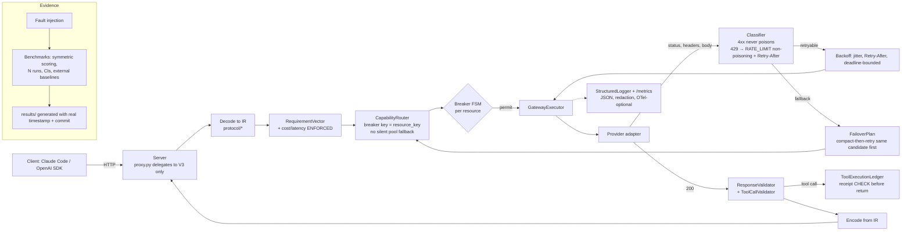

# LLM Circuit Breaker — Independent Adversarial Review (LLM2)

**Reviewer:** LLM2 (Claude Fable 5.1, independent second reviewer)  
**Review date:** 2026-09-06  
**Repository:** https://github.com/d2epak/llm-circuit-breaker  
**Local checkout:** `/Users/deepak/llm-circuit-breaker` at `feb5cf1` (`feat: output cap auto-clamping, provider pool isolation, and robust failover`)  
**Declared version:** 0.2.0 (`pyproject.toml`), documented as "V3"  
**Method:** Every finding below was reproduced locally against HEAD with the repo's own `.venv` (Python 3.11.15). Nothing in this document is copied from the LLM1 review; where the two reviews agree, the agreement is independent. Where they disagree, I say so explicitly.  
**Scope:** All Python under `src/`, `tests/`, `benchmarks/`, `examples/`; every Markdown file in the repository including `README.md`, `ARCHITECTURE.md`, `SECURITY.md`, `LLM_CIRCUIT_BREAKER_V2_LONG_HORIZON_SPEC.md`, `IMPLEMENTATION_PLAN.md`, `IMPLEMENTATION_LOG.md`, `docs/*.md`, `docs/adr/*.md`, `results/*.md`; CI config; `pyproject.toml`.

---

## 1. Executive verdict

**The repository contains a genuinely good circuit-breaker library wrapped in a gateway that does not work as documented, benchmarked against itself, and described by ~15,000 lines of Markdown that overstate what ships.**

Concretely:

1. **The HTTP proxy that users are told to run never uses the V3 engine.** `proxy.py` instantiates the legacy `UniversalFailoverRouter` (V1). Every V3 capability the README advertises (formal breaker, capability routing, protocol IR, tool validation, ledger, FailoverPlan, compaction) is reachable only through the Python `GatewayExecutor` API, which no shipped entry point exposes.
2. **The proxy's operational endpoints are broken at HEAD.** `GET /health`, `/healthz`, `/metrics`, and `/admin/breakers` all raise `AttributeError: 'CircuitBreakerRegistry' object has no attribute 'all_breakers'` and drop the connection. The README's own health-check command therefore fails, as does the snippet in `docs/MIGRATION_V1_TO_V2.md`.
3. **The V3 executor does not honour `Retry-After` and applies no backoff.** A 429 with `Retry-After: 30` is retried on the same endpoint in 0.1 ms. `RetryPolicy.compute_backoff_seconds` exists and is unit-tested, but `GatewayExecutor` never calls it. ADR 0009, `docs/FAILURE_TAXONOMY.md`, and the README all claim the opposite.
4. **The failure taxonomy contradicts its own documentation in the direction that matters.** A generic HTTP 400 is classified `UNKNOWN`, `poisons_health=True`, `retryable=True`, and opens the breaker after two calls; 429 and 402 poison health; 401 (`CLIENT_FAULT`) is `should_fallback=True`. `docs/FAILURE_TAXONOMY.md` and ADR 0003 state the reverse for each.
5. **`ResponseValidator` cannot validate a valid response.** It reads `response.usage`, a field `NormalizedResponse` does not have, so any non-empty, non-tool response raises `AttributeError`. It is never wired into the executor, which is the only reason production code does not crash.
6. **The benchmark evidence is not independent and is partially hard-coded.** Baselines A/B/C are Python loops inside the same harness; V3 is scored `success=True` on any non-exception return while baselines are scored on semantic errors; the "Primary Research Benchmark" hard-codes `duplicate_tool_execution=0` and `semantic_error_rate_pct=0.0`; the report date is a string literal (`"2026-09-03"`) regardless of run date; `docs/BENCHMARKS.md` claims "6 Comparative Baselines" while the harness runs 4.
7. **Importing the package opens a socket to `openrouter.ai:443`** and scans the user's shell dotfiles for API keys. `SECURITY.md` says "zero telemetry".

What is real and good: the `breaker/` package (six-state FSM, count/time sliding windows, bounded half-open permits, injected clock) is correct, deterministic, and well-tested. The `ToolCallValidator` fails closed as promised. The `ContextManager` preserves the planted fact in the tested configuration. The IR dataclasses are a reasonable foundation. The fault-injection `ProgrammableMockAdapter` is the right idea.

**Release readiness:** Not releasable as "production-ready" or "V3". Releasable as "0.2.0: a solid standalone circuit breaker plus an experimental gateway" after the P0 list in §6 is fixed and the README is rewritten to match.

---

## 2. What the Markdown corpus says

There are 37 Markdown files (excluding `.venv`). Grouped by role:

| Group | Files | What they claim |
|---|---|---|
| **Public front door** | `README.md`, `ARCHITECTURE.md`, `SECURITY.md` | "Production-ready agent-resilience gateway", "V3", Resilience4j parity, semantic failover, tool idempotency ledger, "100% completion / 0.0% semantic error rate", "<15ms overhead", "zero telemetry", competitor matrix beating LiteLLM/Portkey/Cloudflare/Kong/Envoy/OpenRouter. |
| **Build contract** | `LLM_CIRCUIT_BREAKER_V2_LONG_HORIZON_SPEC.md` (2,328 lines, §0–§54) | Written for "Antigravity" as implementer with Codex/Claude Code as reviewers. Specifies breaker, taxonomy, 8 routing strategies, retry/backoff with jitter, hierarchical timeouts, IR, tool validation, five compaction strategies, context-overflow recovery, Mode A streaming, OTel, YAML config, verification probes, statistical benchmark methodology (§44), an end-to-end acceptance scenario (§50), and negative requirements (§51). |
| **Self-audit trail** | `docs/AUDIT_BASELINE.md`, `docs/IMPLEMENTATION_BASELINE.md`, `IMPLEMENTATION_PLAN.md`, `IMPLEMENTATION_LOG.md`, `docs/GAP_REGISTER.md`, `docs/CLAIM_AUDIT.md`, `docs/FINAL_SELF_CRITIQUE.md` | All dated 2026-09-03, all authored by "Antigravity". The log ends with "**COMPLETE & PRODUCTION-READY (V2 Milestone Achieved)**". `AUDIT_BASELINE.md` cites a "Master Engineering Mandate (Phases 0–64)" as the evaluation standard. |
| **Subsystem docs** | `docs/RELIABILITY_MODEL.md`, `FAILURE_TAXONOMY.md`, `ROUTING_POLICY.md`, `SEMANTIC_FAILOVER.md`, `CONTEXT_MODEL.md`, `TOOL_SAFETY.md`, `STREAMING.md`, `OPERATIONS.md`, `BENCHMARKS.md`, `COMPETITOR_MATRIX.md`, `MIGRATION_V1_TO_V2.md` | Detailed behavioural claims per subsystem; many with concrete numbers and field names. |
| **ADRs** | `docs/adr/0001`–`0010` | Decisions on FSM, sliding window, taxonomy, capability registry, IR, context budget, tool validation, streaming, retry/fallback, pool isolation. |
| **Results** | `results/v2_benchmark_report.md`, `results/v3_benchmark_report.md` | Tables of completion/recovery/latency by scenario. |
| **Prior review** | `llm-circuit-breaker-llm1-comparison.md` (untracked) | First reviewer's report. Not used as input to this review. |

**Three structural observations about the corpus:**

- **The "Master Engineering Mandate" is cited but absent.** `docs/AUDIT_BASELINE.md` ("Evaluation Standard: Master Engineering Mandate (Phases 0–64)"), `docs/GAP_REGISTER.md` ("Review Standard: Master Engineering Mandate"), `docs/CLAIM_AUDIT.md` ("Mandate Section 4"), `docs/FINAL_SELF_CRITIQUE.md` ("Mandate Section 61"), `tests/unit/test_red_team.py` ("Mandate Section 56"), and `benchmarks/semantic_failover/runner.py` ("Mandate Section 43") all reference section numbers of a document that is not in the repository. Section numbers cited (up to 64) exceed the 54 sections of the V2 spec that is in the repo, so they are not aliases. The audit trail therefore audits against an invisible standard. §12 of this review treats the V2 spec as the build contract instead.
- **Every audit document is dated the same day as the code it audits and signed by the same author.** The self-critique, claim audit, gap register, and "COMPLETE & PRODUCTION-READY" log entry were produced by the implementer in the same session. `docs/CLAIM_AUDIT.md` marks "Semantic failover for autonomous agents" and "100% rejection of corrupt tool calls" as **PROVEN**; §4 below shows the executor does not retry correctly and the validator is unreachable. This is the "self-critique loop" anti-pattern, and the documents should be read as the implementer's intentions, not as verification.
- **The docs describe fields and defaults that do not exist in code.** Examples verified: `FailoverPlan.source_context_window` and `tools_adapted_count` (`docs/SEMANTIC_FAILOVER.md`) are not fields of `FailoverPlan`; `ContextBudget` defaults documented as 2048/512 with tail=2 (`docs/CONTEXT_MODEL.md`) are 4096/2048 with tail=6 in code; `MAX_PAYLOAD_BYTES` documented as 10 MB (`docs/OPERATIONS.md`, `FINAL_SELF_CRITIQUE.md`) is 25,000,000 in `security/defense.py`; the "7 categories / 16 reasons" of `docs/FAILURE_TAXONOMY.md` are 6 and 19 in code; port is 8000 in README, 4001 in `proxy.py`, 8080 in `config.py` and the spec.

---

## 3. Verified implementation state

### 3.1 Evidence table

Each row was executed on 2026-09-06 against `feb5cf1`.

| # | Check | Command / method | Result |
|---|---|---|---|
| E1 | CI test suite | `python -m unittest discover -s tests` | 25 tests pass. CI runs **only** this; the other 59 pytest-collected tests are not run in CI. |
| E2 | Full test suite | `pytest` | 84 pass. No end-to-end `GatewayExecutor` over HTTP; no test hits the running proxy. |
| E3 | README proxy command | `python -m llm_circuit_breaker.proxy.server --port 8000` | `ModuleNotFoundError: __path__ attribute not found on 'llm_circuit_breaker.proxy'`. |
| E4 | Proxy GET endpoints | `start_proxy_server(...).serve_forever()` then `curl /health`, `/healthz`, `/metrics`, `/admin/breakers` | All four crash in the handler: `AttributeError: 'CircuitBreakerRegistry' object has no attribute 'all_breakers'` (`proxy.py:60`, `:84`, `:95`). Registry exposes `all()`. Connection closed with no response (`HTTP 000`). |
| E5 | Proxy POST `/v1/messages` | Valid Anthropic body | **200 in 0.47 s from a live upstream** using a key the proxy scraped from my environment. Response `model` echoes the requested `claude-3-5-sonnet` although served by an OpenAI-compatible provider (`id: chatcmpl-…`). |
| E6 | Proxy malformed `Content-Length: abc` | `curl -H "Content-Length: abc"` | `int()` raises; connection dropped, no 400. |
| E7 | Proxy invalid JSON | `-d '{not json'` | Correct 400 with message. |
| E8 | Import side effects | `python -c "import llm_circuit_breaker"` with socket tracing | Opens TCP to `openrouter.ai:443` (discovery) and reads `~/.zshrc`, `~/.bashrc`, etc. for key patterns. |
| E9 | `start_proxy_server` | Call it | Returns the server without calling `serve_forever()`; only `main()` serves. README/Migration text implies it starts serving. |
| E10 | README SDK snippet | Copy-paste | Raises `NoHealthyRouteError` (no endpoints registered by default in the pool it names). |
| E11 | `GatewayConfig().to_breaker_config()` | Call it | `TypeError` (`wait_duration_in_open_seconds` is not a `CircuitBreakerConfig` field). |
| E12 | `ResponseValidator.validate(valid_text_response, req)` | Direct call | `AttributeError: 'NormalizedResponse' object has no attribute 'usage'`. Only the two negative-path tests pass because they short-circuit before that line. |
| E13 | Executor: 429 with `Retry-After: 30` | `ProgrammableMockAdapter` sequence `[rate_limit(30), success]` | 2 attempts, same endpoint, **0.1 ms elapsed**. No sleep, no backoff, `Retry-After` ignored. |
| E14 | Executor: 401 | `[401]*5` then fallback provider | 4 attempts (3× same endpoint + fallback), 0.3 ms elapsed. Non-retryable classification retried; no backoff. |
| E15 | Executor: generic 400 (`unsupported parameter: tools`) | `[400]*5` then fallback | Classified `UNKNOWN`, `poisons_health=True`; breaker for the endpoint is **OPEN** after 2 calls; ledger reports `fallback_count=0` yet 1 `FailoverPlan` and the fallback provider served the response. |
| E16 | Executor: tool-call id | `valid_tool_call("bash", {...})` with id `tc_bash` | Client receives id `att_1_tc_bash`. ADR 0005 claims "zero data loss for multi-turn tool call IDs". |
| E17 | Classifier | `classify_api_error` for 400/401/402/413/429 | 429 → `poisons_health=True`; 402 → category `RATE_LIMIT`, poisons; 401 → `should_fallback=True`; generic 400 → `UNKNOWN`, poisons, retryable. |
| E18 | Compaction with over-budget protected content | 50k-token system message, `ContextBudget(65536,4096,2048)` | Returns unchanged; still over budget; no error raised. |
| E19 | Benchmark suite | `python -m benchmarks.run` | Runs; overwrites `results/` with a report whose `date` is the literal `"2026-09-03"`. V3 100%/60%, A 53.3%/0%, B 93.3%/40%, C 93.3%/46.7%. Latencies differ from README (0.12/1.04 ms) and from committed results (0.140/1.642 ms). |
| E20 | Demo | `python -m llm_circuit_breaker.demo` | Works, deterministic. |
| E21 | Repo hygiene | `git status` | `.DS_Store` present in root, `benchmarks/`, `src/`, `tests/` and not ignored; README contains `file:///Users/deepak/...` links. |
| E22 | LOC | `wc -l` | `src/` 7,263 lines, `tests/` 2,386, `benchmarks/` 964. |

### 3.2 The architectural split (two data planes)

```
CLIENT (Claude Code / OpenAI SDK)
        │  HTTP
        ▼
proxy.py  ──►  UniversalFailoverRouter (V1)  ──►  pools.py cooldown map
                     │                              translators.py (pairwise, repair_json_string)
                     │                              pruner.py (≤4-message bypass)
                     │                              urllib + spoofed Chrome UA
                     ▼
              upstream provider

                (never called by the proxy)

GatewayExecutor (V3) ──► CapabilityRouter ──► breaker/ FSM ──► provider adapters
        │                     │                                 protocol/{openai,anthropic,gemini}
        │                     └── scorer.py (no cost/latency constraint enforcement)
        ├── ContextManager (compaction)
        ├── ToolCallValidator (fail-closed)      ◄── good
        ├── ToolExecutionLedger (never consulted before execution)
        └── FailoverPlan (emitted, not acted on)
```

`grep -n "GatewayExecutor\|CapabilityRouter" src/llm_circuit_breaker/proxy.py` returns nothing. The proxy imports `UniversalFailoverRouter` at line 27 and instantiates it with `auto_discover_free=True` at module import (line 35).

### 3.3 Feature truth table

| Feature (as advertised) | Documented | Implemented | Wired into proxy | Wired into `GatewayExecutor` | Tested | Verified by LLM2 | Verdict |
|---|:---:|:---:|:---:|:---:|:---:|:---:|---|
| Six-state breaker FSM | Yes | Yes | No | Yes | Yes (12) | Yes | **Real.** Best component in repo. |
| Sliding window (count/time) | Yes | Yes | No | Yes | Yes | Yes | Real. Docs claim O(1) snapshot; it iterates the deque. |
| Bounded half-open permits | Yes | Yes | No | Yes | Yes (120 threads) | Yes | Real. Load test forces `cb._state` privately. |
| `METRICS_ONLY` / `DISABLED` states | Yes | Enum only | No | Router ignores them | No | Yes | **Partial.** No `metrics_only()` transition method; router only excludes OPEN/FORCED_OPEN. |
| Non-poisoning taxonomy | Yes | Contradicts docs | — | Yes | Partial | Yes | **Broken as documented** (E15, E17). |
| Retry with jitter + `Retry-After` | Yes | `compute_backoff_seconds` exists | No | **Never called** | Unit only | Yes | **Not delivered** (E13, E14). |
| Capability hard constraints | Yes | Partial | No | Yes | Yes (5) | Yes | Tools/vision/reasoning/context enforced. `maximum_cost_usd`, `latency_budget_ms`, `task_class` are dead fields. |
| Routing strategies | 8 in spec | 6 | No | Yes | Partial | Yes | `weighted`, `adaptive` absent; `Endpoint.weight` unused. |
| Pool isolation | Yes | Yes | V1 only | Leaks | Yes | Yes | Empty pool silently falls back to **all** endpoints. |
| Breaker keyed per resource | Yes | `provider:model` | — | — | — | Yes | Deployment/quota bucket dimensions ignored. |
| Protocol IR + three adapters | Yes | Yes | No | Yes | Yes (3) | Yes | `tool_choice` dropped in all three; `created` is random; Anthropic thinking blocks lack `signature`; Gemini uses deprecated `function` role and mints fresh tool ids each turn; V3 Gemini imports V1 `translators.py`. |
| Tool-call validation (fail closed) | Yes | Yes | No | Yes | Yes (5) | Yes | **Real.** Trailing-comma regex applies to whole string including string values. |
| Tool execution ledger | Yes | Yes | No | Written, never read for gating | Yes (3) | Yes | Receipt never checked before a re-execution; no eviction; key excludes request/turn. |
| `FailoverPlan` | Yes | Yes | No | Emitted | Yes | Yes | Observability only; field names differ from docs. |
| Context compaction | Yes | Yes | V1 pruner only | Yes | Yes | Yes | Never shrinks system/root/tail; over-budget protected content passes silently. |
| Context-overflow recovery (spec §15) | Yes | No | No | No | No | Yes | Not implemented. |
| True streaming (Mode A) | Yes | No | No | No | No | Yes | Only synthetic SSE; `output_tokens: 1` hard-coded. |
| `ResponseValidator` | Yes | Crashes on valid input | No | No | 2 negative tests | Yes | **Unusable** (E12). |
| SSRF defence | Yes | Yes | No | No | Yes | Yes | `allow_localhost=True` default; no RFC1918 block; not called by adapters. |
| Structured logging + redaction | Yes | Yes | No | No | Yes | Yes | Redacts `input_tokens`/`max_tokens` (regex over-match); never used by executor or proxy. |
| SQLite persistence | Yes | Yes | No | No | Yes | Yes | No WAL despite docs; `check_same_thread=False`; no caller in `src/`. |
| `AgentState`/`StateSnapshot` | Yes | Yes | No | Only via `FailoverPlan` import | Yes | Yes | Never populated from a live request. |
| Discovery verification probes (spec §23) | Yes | No | — | — | No | Yes | Catalog scrape only. |
| OTel / metrics export (spec §19) | Yes | No | Broken endpoint | No | No | Yes | `/metrics` crashes (E4). |
| YAML config with validation (spec §27) | Yes | Partial | No | No | No | Yes | `to_breaker_config()` raises (E11). |
| `/health` | Yes | Crashes | — | — | No | Yes | **Broken** (E4). |
| Zero telemetry | Yes | No | — | — | — | Yes | Import-time call to OpenRouter; dotfile key scan (E8). |
| Zero deps | Yes | Yes | — | — | — | Yes | True. |

---

## 4. Strengths

Stated before the weaknesses because they are real and worth protecting.

1. **`breaker/circuit_breaker.py` is a correct Resilience4j-style FSM.** Injected monotonic clock, atomic transitions under a lock, count- and time-based windows, slow-call rate, bounded half-open permits with in-flight counting, `FORCED_OPEN`. The 12 spec tests are deterministic and meaningful. A 120-thread contention test passes. This is the one component I would ship today.
2. **`ToolCallValidator` fails closed.** Missing required fields, unknown tool names, and unparseable JSON produce `INVALID`/`UNSAFE_TO_REPAIR` rather than guesses. The syntactic-only normalisation set (fence strip, trailing comma, whitespace) is the right boundary. This is a real differentiator relative to gateways that pass tool arguments through untouched.
3. **`ProgrammableMockAdapter` is the right testing primitive.** A sequenced fault injector with `success/rate_limit/server_error/timeout/context_overflow/malformed_tool_json/valid_tool_call` covers the important classes and needs no network.
4. **The IR is a sensible centre.** `NormalizedRequest/Response/Message/ToolCall/ToolResult/ToolDefinition` are simple dataclasses. The O(N) adapter argument in ADR 0005 is valid even if the adapters are incomplete.
5. **`ContextManager` gets the retention priority right** (system > root turn > tail > compact tool results > evict middle). The structured tool-result extractor preserving `FATAL…exit code 137` in the test is a good idea.
6. **The demo runs with zero keys** and shows a full trip-recover cycle deterministically.
7. **Zero third-party dependencies** is true and rare.
8. **The V2 spec is a good document.** §44 (statistical methodology), §50 (acceptance scenario), and §51 (negative requirements) are exactly what an implementer needs. The failure is that the implementation and the audit trail did not hold themselves to it.

---

## 5. Critical weaknesses

Severity: **P0** = users are misled or the advertised path fails; **P1** = correctness defect in a shipped V3 subsystem; **P2** = quality/maintainability.

### P0

| ID | Finding | Evidence | Why it matters |
|---|---|---|---|
| **P0-1** | **The HTTP proxy is V1 and every V3 capability is unreachable from it.** | `proxy.py:27,35`; `grep` for `GatewayExecutor` in proxy returns nothing (§3.2). | The README's architecture, benchmarks, competitor matrix, and ADRs describe code that the shipped server never executes. Users running `llm-proxy` get cooldown timers, a spoofed Chrome UA, the `≤4-message` pruner bypass, and `repair_json_string`'s semantic repair (§P1-8). |
| **P0-2** | **`/health`, `/healthz`, `/metrics`, `/admin/breakers` crash.** | E4. `proxy.py:60,84,95` call `DEFAULT_BREAKER_REGISTRY.all_breakers()`; `breaker/registry.py` defines `all()`. Same bug in `docs/MIGRATION_V1_TO_V2.md:93`. | Any liveness probe fails. The bug is one word and was not caught because no test starts the server. `IMPLEMENTATION_LOG.md` Phase 13 says these endpoints were "added" and "51 passed". |
| **P0-3** | **No backoff and no `Retry-After` in the V3 executor.** | E13, E14. `grep -n "backoff\|sleep" execution/executor.py` returns nothing. | A rate-limited provider is hammered at CPU speed. ADR 0009 ("Exponential Backoff with Full Jitter … Explicit Retry-After headers take precedence"), `docs/FAILURE_TAXONOMY.md`, and README all claim this is implemented. The unit test for `compute_backoff_seconds` passes because it tests the policy object, not the executor. |
| **P0-4** | **Taxonomy poisons health on 4xx in the opposite way to the docs.** | E15, E17. Generic 400 → `UNKNOWN/poisons=True/retryable=True`, breaker OPEN after 2 calls; 429 and 402 poison; 401 `should_fallback=True`. ADR 0003 and `docs/FAILURE_TAXONOMY.md` say 4xx client/request faults never poison. | A single agent sending an unsupported parameter opens the breaker for every other agent sharing the endpoint. This is precisely the cascade ADR 0003 says the design prevents. Note the V2 spec §5 does list 429 as an availability failure, so 429 poisoning is a docs-vs-docs conflict; the 400 and 402 behaviour has no support anywhere. |
| **P0-5** | **Benchmarks are self-refereed and partially constant.** | `benchmarks/harness.py`: baselines A/B/C are in-process loops; V3 scored `success = True` on non-exception, baselines scored `success = not has_sem_err`; A/B/V3 check `"wrong_arg"`, C checks `"unknown_arg"`; p95 = `sorted(lats)[int(n*0.95)]` = max of 15. `benchmarks/semantic_failover/runner.py`: `duplicate_tool_execution=0`, `semantic_error_rate_pct=0.0` hard-coded; `state_preserved` tests the **original** request (executor compacts a copy) so it is always true. `benchmarks/run.py` hard-codes `"date": "2026-09-03"`. Roughly 7 of 15 scenarios cannot discriminate (B8 ledger never exercised, B9 no streaming exists, B10 success-only sequence, B12 both succeed, B13 nothing checks cost, B14 identical providers, B15 `tools=[]`). | The headline "100% completion / 0.0% semantic error rate" in README and `docs/BENCHMARKS.md` is an artefact of asymmetric scoring and hard-coded constants, not a measurement. `docs/BENCHMARKS.md` says "6 Comparative Baselines"; there are 4. Spec §31 required a V1 baseline and §44 required repeated runs with confidence intervals; neither exists. |
| **P0-6** | **Import-time network and dotfile key scanning contradict `SECURITY.md`.** | E8. `pools.py:25` "Scan process environment and config files for API keys"; `proxy.py:35` `auto_discover_free=True` at import. The live 200 in E5 was produced with a key the proxy found in my shell profile without my telling it to. | "Zero telemetry" is false in the sense a security reviewer cares about: the package phones out on import and reads secrets from files it was not pointed at. Also makes `import llm_circuit_breaker` fail offline. |
| **P0-7** | **`ResponseValidator` raises on every valid response.** | E12. `validation/response.py` reads `response.usage`; `NormalizedResponse` has `input_tokens`/`output_tokens` only. | The "Response Validation Pipeline" row marked PARTIAL/TESTED in `AUDIT_BASELINE.md` and the "catches many" claim in `FINAL_SELF_CRITIQUE.md §3` describe a class that has never validated a success. Not wired into the executor, so it fails silently rather than loudly. |
| **P0-8** | **README quick-start does not work.** | E3, E10, E11. Module path wrong; SDK snippet raises; config→breaker conversion raises; ports disagree (8000/4001/8080); `file:///Users/deepak/...` links. | First-run experience fails at every documented entry point except the demo. |

### P1

| ID | Finding | Evidence |
|---|---|---|
| **P1-1** | **Tool ledger never gates execution.** `ToolExecutionLedger` is written (`mark_validated/mark_failed`) but the executor never checks for an existing `COMMITTED` receipt before returning a duplicate tool call to the client. Key is `f"{op}:{tool}:{sha256(args)}"` with no turn/request scope and no eviction (unbounded memory). | `execution/executor.py:208-243`; B8 scenario never exercises the ambiguity path. |
| **P1-2** | **Tool-call ids are rewritten** to `att_{n}_{id}`. Breaks any client that correlates ids with its own bookkeeping and contradicts ADR 0005. | E16. |
| **P1-3** | **Executor ignores `retryable` and `should_fallback`** from the classification; retry count is purely `max_attempts_same_endpoint`. | E14 (401 retried 3×). `grep retryable executor.py` shows only the literal set on a synthetic classification. |
| **P1-4** | **Ledger `fallback_count` disagrees with reality.** 400 case: fallback provider served the request, one `FailoverPlan` emitted, `fallback_count=0`. | E15. |
| **P1-5** | **Pool isolation silently bypassed.** `CapabilityRouter.select_candidate`: empty pool → all endpoints. ADR 0010 says pools are strictly decoupled. | `routing/router.py`. |
| **P1-6** | **Breaker key omits deployment/quota bucket.** `f"{ep.provider}:{ep.model}"` vs `Endpoint.resource_key`. Two Azure deployments of the same model share one breaker. `AUDIT_BASELINE.md` marks "Multi-Dimensional Resource Model" PARTIAL and `GAP_REGISTER.md` GAP-M02 was never closed. | `routing/router.py`. |
| **P1-7** | **Dead requirement fields.** `maximum_cost_usd`, `latency_budget_ms`, `task_class` accepted and ignored in `matches_hard_constraints`. `docs/ROUTING_POLICY.md` and spec §22 describe cost ceilings; B13 "Cost Constraint" passes because nothing checks. | `routing/requirements.py`. |
| **P1-8** | **V1 `repair_json_string` performs the exact semantic repair the spec forbids** (`{"command": cleaned}` or `{"text": cleaned}` fallback) and is still on the live proxy path via `openai_to_anthropic_response`. `IMPLEMENTATION_BASELINE.md §5.3` named this as a defect to remove; `IMPLEMENTATION_PLAN.md` Phase 4 said `translators.py` would "delegate to IR". It does not. | `translators.py`; spec §12, §51. |
| **P1-9** | **Compaction cannot fail loudly.** Protected content over budget returns unchanged with no error; caller cannot tell. Spec §15's compact-then-retry-same-candidate recovery is absent. | E18; `agent/context.py`. |
| **P1-10** | **Capability lookup is fuzzy and optimistic.** `get_profile` substring-matches keys in dict order (`gpt-4o` can resolve to `gpt-4o-mini` depending on insertion order); unknown models default to `supports_tools=True, context_window=32768`. Spec §6 says unknown ≠ true. | `capability/registry.py`. |
| **P1-11** | **Protocol adapters drop data.** `tool_choice` dropped by all three emitters; OpenAI `created` = `uuid4().time_low` (random); Anthropic `thinking` blocks emitted without `signature` (real API rejects); tool_result lists flattened to text (images lost); Gemini `role: "function"` (deprecated) and fresh `call_{uuid}` per response (ids unstable across turns); V3 `protocol/gemini.py` imports V1 `translators.clean_gemini_schema`, which drops `$defs` (breaks `$ref`). | `protocol/*.py`, `translators.py`. |
| **P1-12** | **Adapter error handling flattens everything to 599.** `BaseHTTPAdapter.execute` catches all exceptions → status 599; the classifier then sees a synthetic code, not the socket/SSL/timeout distinction the taxonomy wants. Anthropic adapter keeps only the last text block. Unknown provider → OpenAI adapter silently. | `providers/adapters.py`. |
| **P1-13** | **Telemetry counters undercount.** `HealthTelemetryStore.record_failure` only increments per-status counters when `status_code` is supplied; the executor passes none. Cold-start `success_rate=1.0` means a brand-new endpoint outranks a proven one under `reliability_aware`. | `health/telemetry.py`, `routing/scorer.py`. |
| **P1-14** | **Slow-call detection only on success path.** A 30 s 500 is a failure but not a slow call; slow-call rate under-reports during brown-outs. HALF_OPEN close log prints "0 successful calls". | `breaker/circuit_breaker.py`. |
| **P1-15** | **Security module is decorative.** `validate_upstream_url(allow_localhost=True)` default skips the blocked-host regex, no RFC1918 block, and no adapter calls it. `enforce_payload_limit` 25 MB vs documented 10 MB; proxy `Content-Length` parse crashes on non-integer (E6). Logger redaction regex matches `input_tokens`/`max_tokens`. | `security/defense.py`, `observability/logger.py`, `proxy.py:117`. |
| **P1-16** | **`examples/durable_runner.py` overwrites `~/.claude/settings.json` and runs `claude --dangerously-skip-permissions`.** Destructive to user config; contradicts the repo's own CLAUDE.md caution norms. | `examples/`. |
| **P1-17** | **Test suite gaps that let all of the above through.** No server test; no executor backoff timing test; `test_red_team.py` imports `ResponseValidator` and never uses it; `test_05` asserts a fact in `messages[0]`, which compaction never touches; concurrency test forces `cb._state` privately; CI runs `unittest discover` (25) not `pytest` (84); no lint/type/coverage gates despite spec §42. | `tests/`, `.github/workflows/ci.yml`. |

### P2

| ID | Finding |
|---|---|
| P2-1 | `Any` used in a type annotation in `routing/router.py` without import; latent under `from __future__ import annotations`. |
| P2-2 | `benchmarks/harness.py` injects adapters via private `reg._adapters`; tests do the same. Registry needs a public `register(provider_id, adapter)`. |
| P2-3 | `estimate_tokens = (len+3)//4` is the only tokenizer; docs call compaction "budget-aware" with "exact input budget". |
| P2-4 | V1 `Retry-After` clamped to 30–120 s regardless of header. |
| P2-5 | `.DS_Store` committed-adjacent and unignored; `llm-circuit-breaker-llm1-comparison.md` untracked; `results/` mutated by every benchmark run. |
| P2-6 | Docstrings and docs refer to "Rule 3" and "Rule 1" for the same fail-closed rule (`TOOL_SAFETY.md` vs `FINAL_SELF_CRITIQUE.md §8` vs ADR 0007). |
| P2-7 | `docs/adr` vs `docs/ADR` casing (`IMPLEMENTATION_PLAN.md` says `docs/ADR/0001-target-architecture.md`; actual is `docs/adr/0001-circuit-breaker-state-machine.md`). |

---

## 6. Current state of the art (September 2026)

Refreshed 2026-09-06 via web search; sources listed in §15.

| System | Breaker / cooldown | Retry & `Retry-After` | Capability-aware routing | Tool-call safety | Context adaptation | Streaming failover | Overhead |
|---|---|---|---|---|---|---|---|
| **LiteLLM** (Python) | Cooldown cache keyed on failure rate (>50 %) or 429; Redis-shared; half-open style periodic probes. Effectively a breaker "in everything but name". | `num_retries` with backoff; `Retry-After` honoured; `context_window_fallbacks` and `content_policy_fallbacks` are typed. | Model-group `order`; 2026 routing plugins (v1.92+) with heuristic/LLM/semantic classifiers and Thompson-sampled pools. | Passthrough. | Typed context-window fallback. | Standard SSE passthrough. | 10–50 ms (Python). |
| **Portkey Gateway 2.0** (Node, Apache-2.0 since Mar 2026; acquired by Palo Alto Networks Apr 2026) | Real `cb_config` per strategy: `failure_threshold_percentage`, `minimum_requests`, `cooldown_interval`, `failure_status_codes`; bypass-on-all-open. | Up to 5 retries with exponential backoff. | Conditional routing on metadata/guardrail outcomes; conditional strategies excluded from breaker. | Guardrails (50+). | No. | SSE passthrough. | Low ms. |
| **Bifrost** (Go, Apache-2.0, Maxim) | Provider-level breaker with periodic recovery probes. | 5xx/network → same key with exp backoff + jitter; 429/401/402/403 → rotate key. | Model catalog + weighted keys; enterprise adaptive load balancing re-weights every 5 s on error/latency/utilisation. | MCP-native. | No. | Passthrough. | ~11 µs at 5k RPS (vendor). |
| **Cloudflare AI Gateway** | Dynamic Routing flows with fallbacks; unified billing (5 % fee); Workers AI merge Aug 2026. | Yes. | Route versioning; roadmap "model-first routing". | DLP/guardrails. | No. | Passthrough. | Edge. |
| **Envoy AI Gateway 1.0/1.1** (Jun 2026 GA) | Envoy outlier detection. | Envoy retry filter; 1.1 adds stream idle timeout with failover. | 16 providers, CEL backend selection, quota-aware. | MCP gateway. | No. | Passthrough + idle failover. | 1–3 ms. |
| **Kong AI Gateway 3.14** (Apr 2026) | Passive health checks. | Yes. | Semantic (embedding) routing since 3.8; MCP tool ACLs. | Tool ACLs. | No. | Passthrough. | 2–5 ms (Nginx/Lua). |
| **OpenRouter** | Provider-level outage tracking (30 s window); inverse-square-price weighting. | Yes. | `require_parameters: true` refuses providers that would drop `tools`; `provider.order/only/ignore`. | Best-effort tool-capable routing. | No. | Passthrough. | Hosted. |
| **This repo (V3 executor)** | Real FSM (best in class as a library). | **None** (E13). | Hard constraints for tools/vision/reasoning/context; cost dead. | Fail-closed validator (real differentiator). | Compaction (partial). | Synthetic only. | ~0.1 ms in-process; unmeasured over HTTP. |
| **This repo (shipped proxy)** | Cooldown timestamps. | Clamped 30–120 s. | Static lists + round-robin. | Semantic repair (unsafe). | ≤4-message bypass. | Synthetic only. | Unmeasured. |

**Research context.** LLMRouterBench (arXiv 2601.07206, Findings@ACL'26; 400K+ instances, 21 datasets, 33 models, 10 routers) finds that many routers, including commercial ones, "fail to reliably outperform a simple baseline" and that the gap to Oracle is dominated by model-recall failures, not scoring. TwinRouterBench (arXiv 2605.18859, v2 May 2026) is the first step-level benchmark for **agentic** routing (SWE-bench, BFCL, mtRAG, QMSum, PinchBench) with a live SWE-bench Verified track measuring realised API cost; its follow-up "The Replay Gap" (arXiv 2608.08239) shows static replay of model switches "scores the wrong world". Implication for this repo: the novel claim ("semantic failover for agents") sits in exactly the space these benchmarks measure, and none of the repo's 15 scenarios or its "Primary Research Benchmark" measure downstream task success after a switch. The competitor matrix's assertion that only V3 has "Multi-Turn Semantic Failover" is unfalsified rather than proven.

**Where this repo would genuinely lead if finished:** (a) a standalone, dependency-free Python breaker with a spec-grade test suite; (b) fail-closed tool-argument validation at the gateway; (c) an explicit, auditable `FailoverPlan`. Nobody in the table above does (b) or (c). Everything else in the README is table stakes that competitors already do better.

---

## 7. A credible world-class architecture

The target is not "more features". It is one data plane, a truthful README, and evidence produced by something other than the code under test.



Design rules that fall out of the findings:

1. **One data plane.** `proxy.py` becomes a thin HTTP shell over `GatewayExecutor`; `UniversalFailoverRouter` becomes a compatibility façade over the same executor or is deleted with a major-version bump.
2. **Classification is the source of truth for retry/fallback.** The executor reads `retryable`, `should_fallback`, `poisons_health`, `retry_after_seconds` and nothing else decides those.
3. **Breaker identity = `Endpoint.resource_key`.**
4. **Every "never" in spec §51 gets a test that fails if violated** (no semantic repair, no global socket timeout, no synthetic streaming presented as real, no 2xx-with-error treated as success).
5. **Benchmarks score every system with the same predicate**, run N≥30 times with seeds, and report CIs. At least one baseline is an external system (LiteLLM router in-process is enough).
6. **The README claims only what §3.3 marks "Real".**

---

## 8. Delivery plan and release gates

| Gate | Exit criteria | Blocks |
|---|---|---|
| **G0 — Truthful docs** (1 day) | README rewritten to §3.3 "Real" rows; port unified; `file://` links removed; "V3"/"production-ready" removed; competitor matrix reduced to verified rows or deleted; `docs/BENCHMARKS.md` "6 baselines" corrected; audit docs annotated "author self-assessment, 2026-09-03". | Any public announcement. |
| **G1 — Proxy works** (2 days) | `all_breakers()` → `all()`; `Content-Length` parse guarded; `start_proxy_server` serves or is renamed `create_proxy_server`; README command matches `pyproject` entry point; an HTTP test starts the server and asserts 200 on `/health`, `/metrics`, and one `/v1/messages` round-trip against `ProgrammableMockAdapter`. | Release. |
| **G2 — Executor correctness** (1 week) | Backoff with jitter and `Retry-After` wired and tested with a fake clock; `retryable`/`should_fallback` honoured; classifier table fixed (400/401/402/413 non-poisoning; 429 non-poisoning with Retry-After); tool-call ids preserved; `fallback_count` correct; `ResponseValidator` fixed and wired; ledger receipt checked before returning a duplicate call; pool fallback removed; breaker keyed by `resource_key`; cost/latency constraints enforced or fields deleted. | "V3" label. |
| **G3 — Proxy on V3** (1 week) | `proxy.py` routes through `GatewayExecutor`; V1 `repair_json_string` fallback removed from the live path; import-time discovery and dotfile scanning off by default (`LLM_CB_AUTO_DISCOVER=1`, explicit `--scan-dotfiles`). | "Zero telemetry" claim. |
| **G4 — Honest benchmarks** (1 week) | Symmetric success predicate; hard-coded metrics removed; report date/commit from runtime; N runs + CIs (spec §44); V1 and LiteLLM baselines; scenarios B8/B9/B10/B12/B13/B14/B15 rewritten so they can fail. | Any benchmark claim. |
| **G5 — CI parity** (2 days) | CI runs `pytest` (84+), `ruff`, `mypy --strict` on `breaker/`, coverage ≥80 % on `src/`, package build. | Release. |
| **G6 — Spec §50 acceptance** (1 week) | The end-to-end scenario in spec §50 implemented as a test over HTTP with mock adapters. | "Semantic failover" claim. |

---

## 9. Claims to keep, change, or avoid

| Claim (current wording) | Verdict | Replacement |
|---|---|---|
| "Resilience4j parity circuit breaker" | **Keep** | As is. Add "in-process; no shared state across instances". |
| "Zero third-party dependencies" | **Keep** | As is. |
| "Fails closed on malformed tool calls" | **Keep (executor only)** | "…when used via `GatewayExecutor`; the HTTP proxy currently uses the legacy path." until G3. |
| "Production-ready", "V3" | **Avoid** | "0.2.0 — experimental gateway, stable breaker library". |
| "Honors Retry-After / jittered backoff" | **Avoid until G2** | Delete. |
| "Client faults never poison provider health" | **Avoid until G2** | Delete. |
| "100% completion, 0.0% semantic error rate" | **Avoid until G4** | Report per-scenario outcomes with N and CI; never a single headline number. |
| "<15 ms overhead" | **Change** | "~0.1 ms in-process executor overhead on mock adapters; HTTP overhead unmeasured." |
| "Zero telemetry" | **Avoid until G3** | "Optional OpenRouter catalog discovery (off by default)". |
| "Tool Execution Idempotency Ledger prevents duplicate side effects" | **Avoid until G2** | "Ledger records tool-call state; duplicate suppression not yet enforced." |
| "Lossless / preserves critical state" | **Change** | "Preserves system prompt, first user turn, and last K turns verbatim; compacts tool results; cannot shrink protected content." |
| Competitor matrix "only V3 has X" | **Avoid** | Remove rows not verified against the competitor's current docs (§6 shows Portkey and Bifrost have real breakers; OpenRouter has capability-aware routing). |
| "Semantic failover for autonomous agents" | **Change** | "Capability-aware failover with fail-closed tool validation; downstream task-success preservation not yet measured (see TwinRouterBench)". |

---

## 10. Metrics that would actually prove the thesis

| Metric | Definition | Current status |
|---|---|---|
| **Task success after switch** | Fraction of agent tasks (SWE-bench-style) that still resolve after an induced provider switch, vs. no switch. | Not measured. This is the only metric that proves "semantic failover". |
| **Duplicate side-effect rate** | Tool executions with identical `(op, tool, args)` observed by a stateful mock tool runner under mid-response disconnect. | Hard-coded to 0. |
| **Poison-isolation rate** | Fraction of injected 4xx client faults that leave the breaker CLOSED. | Would fail today (E15). |
| **Retry-After compliance** | Time-to-next-attempt ≥ header value in 100 % of 429 cases. | 0 % (E13). |
| **Recovery time** | Wall-clock from first failure to first success on a healthy fallback, p50/p95 over N≥30 seeded runs. | Single run, max-as-p95. |
| **Gateway overhead** | Added latency at p50/p99 over HTTP against a local mock upstream, at 1/10/100 concurrent. | Unmeasured. |
| **Compaction fidelity** | Planted-fact recall at 25 %, 50 %, 75 % depth in a 100k-token history under 32k budget. | One depth tested. |
| **Doc-drift count** | Number of docs statements with no corresponding code symbol or test (this review found >30). | Not tracked. |

---

## 11. Adversarial review of the "Master Engineering Mandate"

**The mandate is not in the repository.** It is cited by section number in `docs/AUDIT_BASELINE.md` (Phases 0–64), `docs/GAP_REGISTER.md`, `docs/CLAIM_AUDIT.md` (§4), `docs/FINAL_SELF_CRITIQUE.md` (§61), `tests/unit/test_red_team.py` (§56), and `benchmarks/semantic_failover/runner.py` (§43). No file matches `grep -ril "master engineering mandate"` other than those citations. A review cannot evaluate compliance with a standard it cannot read, and neither can the next maintainer. Recommendation: either commit the mandate under `docs/` or remove every citation and re-anchor the audit documents to the V2 spec, which is present.

Because the mandate is absent, this section reviews the document that actually functions as the build contract: **`LLM_CIRCUIT_BREAKER_V2_LONG_HORIZON_SPEC.md`** (§0–§54).

**Structural assessment.** The spec is strong. It states what to build, what never to do (§51), how to prove it (§44, §50), and how to release it (§42). Its principal weaknesses as a contract:

1. **It names an implementer and reviewers in the document** ("Antigravity", Codex, Claude Code). That turned the audit trail into a same-author loop: implementer wrote the audit, the gap register, the claim audit, and the "COMPLETE" log entry on the same day. A contract should name a *verification gate*, not a *person*, and require that the gate be executed by something other than the implementation session.
2. **It over-specifies surface area** (8 routing strategies, five compaction strategies, OTel, YAML, discovery probes, Mode A streaming) **and under-specifies the acceptance test**. §50 is the only end-to-end acceptance scenario, and it was never implemented. The result is 7,263 lines of `src/` in which the thin path (breaker) is excellent and every wide path is partial.
3. **It does not require that claims be traceable to a test.** Spec §42 requires lint/type/coverage but nothing says "no README claim without a test ID". That absence is why `docs/CLAIM_AUDIT.md` could mark unimplemented behaviour PROVEN.
4. **§5 and the taxonomy doc conflict on 429.** The spec lists 429 as an availability failure; `docs/FAILURE_TAXONOMY.md` says it does not poison. Code follows the spec, docs follow neither consistently. The contract should pick one and say why (recommendation: 429 opens a *rate-limit* breaker keyed by quota bucket, not the availability breaker).
5. **It assumes token estimation is solvable with `len/4`.** Budget arithmetic in §14 is presented as exact; the only tokenizer in the repo is a character heuristic. The spec should require per-family calibration or a conservative multiplier.
6. **§31 requires a V1 baseline; §44 requires N runs with CIs.** Both were silently dropped in Phase 12 of `IMPLEMENTATION_PLAN.md`, which lists baselines but no statistical requirement. Dropped requirements should be recorded as such, not omitted.

**Compliance summary against spec sections (verified):**

| Spec § | Requirement | Status |
|---|---|---|
| §1.4 | Causality fields on every attempt | Partial |
| §5 | Breaker incl. `sliding_window_size_seconds` config | Implemented (time window exists; config surface differs) |
| §8 | 8 strategies with `w_tool_success`, `w_availability` terms | 6 strategies; terms absent |
| §9 | `retry_on` / `never_retry_on`, exponential jitter | Policy object only; executor ignores |
| §10 | Connect / TTFT / idle timeouts | Absent |
| §11 | IR fields (`usage`, `response_format`, `reasoning_settings`, `multimodal_parts`) | Absent |
| §12 | Tool validation, `max_repair_attempts` | Validation yes; attempts no |
| §14 | Five compaction strategies | One |
| §15 | Context-overflow recovery | Absent |
| §16–17 | Mode A streaming, `stream_failure_policy` | Absent (enum only) |
| §19 | Metrics/OTel | `/metrics` crashes |
| §20 | "Unavailable until" timestamp on breaker | Absent |
| §21–22 | Weighted/sticky routing, cost budgets | Absent / dead fields |
| §23 | Discovery verification probes | Absent |
| §27 | YAML config with startup validation | Partial; `to_breaker_config` raises |
| §31 | Baselines incl. V1 and LiteLLM | 3 in-harness loops |
| §32 | Targets (>95 % recovery, <5 % duplicates) | Not measurable with current harness |
| §37 | Example directories | Present; one is destructive (P1-16) |
| §42 | CI lint/type/coverage/build | unittest only |
| §44 | Statistical methodology | Absent |
| §50 | E2E acceptance scenario | Absent |
| §51 | Negative requirements | Violated on the live proxy path (semantic repair; synthetic streaming) |

---

## 12. Complete codebase audit

### 12.1 `src/llm_circuit_breaker/` (7,263 lines)

| File | Purpose | Verified issues | Severity |
|---|---|---|---|
| `__init__.py` | Export surface; instantiates singletons | Import triggers `proxy`-level discovery chain; exports both V1 and V3 with no deprecation markers. | P0-6 |
| `proxy.py` | HTTP server | V1 router only; `all_breakers()` ×3; `int(Content-Length)` unguarded; `start_proxy_server` does not serve; model field echoes requested model. | P0-1, P0-2, E6, E9 |
| `router.py` (V1) | `UniversalFailoverRouter` | Spoofed Chrome UA; Retry-After clamped 30–120 s; retries up to 8; no jitter. | P2-4 |
| `pools.py` (V1) | Static routes, cooldowns, key scan | Dotfile scanning; oldest-cooldown eviction re-hammers failing provider. | P0-6 |
| `translators.py` (V1, imported by V3 Gemini) | Pairwise translation, JSON repair | `repair_json_string` semantic fallback; unknown tool → `"bash"` default in two places; `clean_gemini_schema` drops `$defs`. | P1-8, P1-11 |
| `pruner.py` (V1) | Character pruning | `len(messages) <= 4` bypass; 600→250+250 truncation. | P1 |
| `discovery.py` | OpenRouter catalog scrape | Network at import via proxy; no verification probes. | P0-6 |
| `classifier.py` | Status/pattern → classification | 400 UNKNOWN/poisons/retryable; 429/402 poison; 401 fallback=True; `_SSL_PATTERNS` contains `"ssLError"` (never matches lowercased input). | P0-4 |
| `models.py` | `FailureCategory`, `FailureClassification`, `AttemptRecord` | Six categories vs docs' seven. | P2 |
| `errors.py` | Exception hierarchy | Fine. | — |
| `config.py` | `GatewayConfig` | `to_breaker_config()` TypeError; default port 8080. | P0-8 |
| `demo.py` | Deterministic demo | Works. | — |
| `breaker/state.py`, `metrics.py`, `circuit_breaker.py`, `registry.py` | FSM | No `metrics_only()` transition; HALF_OPEN close log "0 successful calls"; slow-call only on success; snapshot iterates deque. Registry method is `all()`. | P1-14 |
| `capability/profile.py`, `registry.py` | `ModelProfile`, `Endpoint`, seeded profiles | Fuzzy substring lookup; optimistic unknown defaults; `gemini-2.5-flash is_free=True` unverified. | P1-10 |
| `routing/requirements.py` | `RequirementVector` | Cost/latency/task_class dead. | P1-7 |
| `routing/scorer.py` | Soft scoring | Cold-start reliability 1.0; latency = `1-(ema/5000)`; no spec §8 terms. | P1-13 |
| `routing/router.py` | `CapabilityRouter` | Pool fallback to all; breaker key `provider:model`; DISABLED/METRICS_ONLY unhandled; `Any` unimported. | P1-5, P1-6, P2-1 |
| `routing/decision.py` | `RoutingDecision` | Fine. | — |
| `protocol/ir.py` | IR dataclasses | No `usage`; missing spec §11 fields. | P0-7 |
| `protocol/openai.py` | OpenAI ↔ IR | Random `created`; `tool_choice` dropped; tool message without `tool_call_id` when no results. | P1-11 |
| `protocol/anthropic.py` | Anthropic ↔ IR | `tool_choice` dropped; thinking without `signature`; tool_result images flattened. | P1-11 |
| `protocol/gemini.py` | Gemini ↔ IR | Imports V1 `translators`; `role: "function"`; fresh ids per response; `tool_choice` ignored. | P1-11 |
| `execution/executor.py` | `GatewayExecutor` | No backoff/`Retry-After`; ignores `retryable`/`should_fallback`; rewrites tool ids; ledger not consulted; `fallback_count` wrong; validator not wired. | P0-3, P1-1..4 |
| `execution/policy.py` | `RetryPolicy`, `FallbackPolicy` | `compute_backoff_seconds` correct but unused. | P0-3 |
| `execution/deadline.py` | `Deadline` | Fine. | — |
| `execution/ledger.py` | `AttemptLedger` | Cycle detection works; `fallback_count` not incremented on breaker-driven switch. | P1-4 |
| `agent/context.py` | `ContextManager`, `ContextBudget` | Cannot shrink protected content; silent over-budget; defaults differ from docs. | P1-9 |
| `agent/tool_validation.py` | `ToolCallValidator` | Trailing-comma regex over whole string. | P2 |
| `agent/idempotency.py` | `ToolExecutionLedger` | Never gates; no eviction; key unscoped. | P1-1 |
| `agent/state.py` | `AgentState`, `StateSnapshot` | Never populated from a request. | P2 |
| `agent/failover_plan.py` | `FailoverPlan` | Field names differ from `docs/SEMANTIC_FAILOVER.md`. | P2 |
| `validation/response.py` | `ResponseValidator` | `.usage` AttributeError; unwired. | P0-7 |
| `security/defense.py` | URL/header/payload checks | `allow_localhost=True` default; no RFC1918; 25 MB; unwired. | P1-15 |
| `observability/logger.py` | JSON logger, redaction | Over-broad key regex; unwired. | P1-15 |
| `health/telemetry.py` | `HealthTelemetryStore` | Counters need `status_code`; cold-start 1.0. | P1-13 |
| `providers/adapters.py` | HTTP adapters | All exceptions → 599; last-text-block only for Anthropic; unknown provider → OpenAI; no streaming; `validate_upstream_url` not called. | P1-12 |
| `streaming/modes.py` | Synthetic SSE | `output_tokens: 1` hard-coded; Mode A absent. | P1 |
| `storage/sqlite.py` | Persistence | No WAL; `check_same_thread=False`; no caller. | P2 |

### 12.2 `tests/` (2,386 lines, 84 tests)

| File | Tests | Assessment |
|---|---|---|
| `tests/test_*.py` (legacy, 14) | 14 | Guard V1 behaviour including `repair_json_string`'s markdown strip; do not assert the semantic-fallback branch either way. |
| `unit/test_circuit_breaker.py` | 12 | **Good.** Spec-grade with `MockClock`. |
| `unit/test_concurrency_load.py` | 1 | 120 threads; forces `cb._state` privately; still valuable. |
| `unit/test_persistence.py` | — | SQLite round-trip; module has no production caller. |
| `unit/test_protocol_ir.py` | 3 | Round-trips only; would not catch `tool_choice` drop or random `created`. |
| `unit/test_red_team.py` | 10 | Imports `ResponseValidator`, never uses it; `test_05` asserts on `messages[0]`, which compaction never touches. |
| `unit/test_routing_engine.py` | 5 | Good for hard constraints; no test for pool-fallback leak or breaker key. |
| `unit/test_streaming_and_providers.py` | — | Verifies `x-goog-api-key` header and EMA alpha; no HTTP. |
| `unit/test_tool_idempotency.py` | 3 | Tests ledger transitions; not executor gating. |
| `unit/test_tool_validation.py` | 5 | Good. |
| `unit/test_agent_semantics.py` | 3 | Good compaction tests at one depth. |
| `unit/test_execution_policy.py` | 4 | Tests policy math, not executor behaviour — the gap that hides P0-3. |
| `unit/test_security_and_validation.py` | 6 | `validate_upstream_url` tests pass because the metadata IP matches the regex; localhost is allowed by default and untested. |
| `faults/test_fault_injection.py` | 3 | The only executor tests; none assert timing, backoff, or id preservation. |
| **Missing** | — | Server/HTTP test; backoff timing test; 4xx non-poisoning test; ledger gating test; spec §50 scenario; `ResponseValidator` success path. |

### 12.3 `benchmarks/` (964 lines)

Covered in P0-5. Additional: `harness.py` mutates `reg._adapters`; `scenarios.py` B11 uses `retry_after=30` which, given P0-3, is never waited on and so the scenario "passes" in 0.3 ms.

### 12.4 `examples/`

`durable_runner.py` overwrites `~/.claude/settings.json` and invokes `claude --dangerously-skip-permissions` (P1-16). Other examples reference ports and modules that do not exist (E3).

### 12.5 CI and packaging

`.github/workflows/ci.yml` runs `python -m unittest discover -s tests` (25 tests) rather than `pytest` (84). No lint, type-check, coverage, or build step. `pyproject.toml` entry point `llm-proxy = "llm_circuit_breaker.proxy:main"` is correct; the README does not use it.

---

## 13. Research refresh

- **LLMRouterBench** (arXiv 2601.07206; Li et al.; Findings@ACL'26). 400K+ instances, 21 datasets, 33 models, 10 routers. Findings: model complementarity is real; most routers, including commercial ones, do not reliably beat a simple baseline; the Oracle gap is driven by model-recall failures; embedding backbone choice matters little; larger ensembles have diminishing returns versus curation. **Relevance:** the repo's `balanced` scorer (0.3/0.3/0.2/0.2 static weights, cold-start 1.0) is exactly the kind of untested heuristic this benchmark shows rarely helps. Recommend replacing "quality" scoring with curated per-pool allowlists until there is evidence.
- **TwinRouterBench** (arXiv 2605.18859; Yang et al.; v2 May 2026). Step-level agentic routing benchmark: static track (970 rows, 520 instances, five workloads) plus live SWE-bench Verified track with realised cost. **Relevance:** this is the first public harness that measures what "semantic failover" claims to preserve. Running the V3 executor as a router in the dynamic track would produce the one number the README lacks.
- **The Replay Gap** (arXiv 2608.08239). Static replay of model switches "scores the wrong world". **Relevance:** the repo's B1–B15 are static replays; the paper's argument applies directly.
- **Bifrost** (Go; github.com/maximhq/bifrost). Vendor-reported ~11 µs overhead at 5k RPS; key rotation on 429/401/402/403; breaker with periodic probes; enterprise adaptive re-weighting every 5 s. **Relevance:** sets the bar for "overhead" claims and shows key-rotation as a distinct recovery axis the repo lacks.
- **Portkey Gateway 2.0** (Mar 2026 open-sourced enterprise features; acquired by Palo Alto Networks Apr 2026). Real per-strategy breaker config. **Relevance:** invalidates the competitor matrix row "Portkey: Partial (Simple error thresholds)".
- **OpenRouter `require_parameters`.** Refuses to fall back to providers that would drop `tools`. **Relevance:** invalidates the matrix claim that OpenRouter has no capability-aware routing.
- **Envoy AI Gateway 1.1** adds stream idle timeout with failover. **Relevance:** the one streaming-failover feature the repo's ADR 0008 says is hard is now shipped by a CNCF project.

---

## 14. Detailed implementation plan

Ordered so each step is verifiable in isolation. Each item names the file, the change, and the test that proves it.

### Phase A — Stop the bleeding (G0, G1)

1. `proxy.py:60,84,95` → `DEFAULT_BREAKER_REGISTRY.all()`. Test: `tests/server/test_proxy_http.py` starts `ThreadingHTTPServer` on port 0 and asserts 200 + JSON on `/health`, `/healthz`, `/metrics`, `/admin/breakers`.
2. `proxy.py:117` → guard `int()` with try/except → 400. Test: `Content-Length: abc` → 400.
3. `proxy.py` → rename `start_proxy_server` to `create_proxy_server` (keep old name as alias that also serves in a thread) or document it. Test: alias still importable.
4. README → replace `python -m llm_circuit_breaker.proxy.server --port 8000` with `llm-proxy` / `python -m llm_circuit_breaker.proxy`; unify port to `GATEWAY_PORT` default 4001 or change code to 8080 and say so once.
5. `docs/MIGRATION_V1_TO_V2.md:93` → `all()`.
6. README → remove `file://` links, "production-ready", "V3", competitor matrix rows not verified; add "Status" section listing §3.3 "Real" rows.
7. `.gitignore` → `.DS_Store`; delete stray files.
8. `examples/durable_runner.py` → refuse to overwrite `~/.claude/settings.json` without `--force`; remove `--dangerously-skip-permissions` default.

### Phase B — Executor correctness (G2)

9. `execution/executor.py` → after a retryable failure, `sleep(policy.retry.compute_backoff_seconds(attempt, retry_after=classified.retry_after_seconds))` bounded by `deadline.remaining`. Inject a sleeper for tests. Test: `[rate_limit(30), success]` with fake sleeper asserts requested sleep == 30.0; `[500, 500, success]` asserts geometric sleeps with jitter within bounds.
10. `execution/executor.py` → branch on `classified.retryable` and `classified.should_fallback`; never retry non-retryable on the same endpoint. Test: `[401]` → exactly 1 attempt on A.
11. `classifier.py` → table: 400/404/413/415/422 → `REQUEST_INCOMPATIBILITY`, `poisons=False`, `retryable=False`, `fallback=True`; 401/403 → `CLIENT_FAULT`, `poisons=False`, `fallback=False` (or `True` only when the fallback uses a different credential; make this explicit); 402 → `BILLING`, `poisons=False`, `fallback=True`; 429 → `RATE_LIMIT`, `poisons=False` for the availability breaker, `retry_after` parsed; fix `"ssLError"`. Test: parametrised table asserting every flag; executor test asserting breaker stays CLOSED after 10 × 400.
12. `execution/executor.py:208` → stop rewriting `tc.id`; record `att_{n}` in the ledger entry's metadata instead. Test: id round-trips.
13. `execution/ledger.py` → increment `fallback_count` whenever the selected endpoint differs from the previous attempt's endpoint. Test: 400 scenario asserts `fallback_count == 1`.
14. `protocol/ir.py` → add `usage: Optional[Usage]` (or fix validator to read `input_tokens`/`output_tokens`); wire `ResponseValidator` into executor after normalisation. Test: success-path validation returns `is_valid=True`; 200-with-error-body rejected (spec §51).
15. `agent/idempotency.py` + executor → before returning a tool call, look up `(operation_id, tool, args_hash)`; if `COMMITTED`, attach the receipt and mark the call `replayed`. Add LRU/TTL eviction. Test: mid-response disconnect scenario with stateful mock tool runner asserts one execution.
16. `routing/router.py` → remove empty-pool fallback (raise `NoHealthyRouteError`); key breaker by `endpoint.resource_key`; exclude `DISABLED`? (no: `DISABLED` passes) — handle `METRICS_ONLY`/`DISABLED` per ADR 0001; import `Any` or drop annotation. Tests: empty pool raises; two deployments have two breakers.
17. `routing/requirements.py` → enforce `maximum_cost_usd` (estimate = tokens × price) and `latency_budget_ms` (EMA) or delete the fields and the docs that mention them. Test: expensive candidate excluded.
18. `capability/registry.py` → exact match then explicit alias map; unknown model → `supports_tools=None` treated as "does not match a tools requirement". Test: `gpt-4o` never resolves to `gpt-4o-mini`; unknown model excluded when tools required.
19. `agent/context.py` → raise `ContextBudgetUnsatisfiable` when protected content exceeds budget; implement spec §15 compact-then-retry-same-candidate in the executor. Tests: over-budget system prompt raises; 413 on candidate A triggers compaction and a second attempt on A before fallback.

### Phase C — One data plane (G3)

20. `proxy.py` → decode HTTP body to IR via `protocol/*`, call `GatewayExecutor.execute`, encode back. Keep `UniversalFailoverRouter` as a façade over the executor for one release, then remove.
21. `translators.py:repair_json_string` → delete the `{"command"/"text"}` fallback; return `None`; callers fail closed. Test: unparseable input → `None`; live proxy path returns a tool-validation error, not a synthesised command.
22. `__init__.py`, `proxy.py`, `pools.py` → discovery and dotfile scanning off by default; opt-in env vars; no network at import. Test: import under a socket-blocking monkeypatch succeeds.
23. `protocol/*` → carry `tool_choice`; `created = int(time.time())`; Anthropic thinking blocks only when `signature` present, else drop to text with a warning; Gemini `role: "user"` with `functionResponse` parts; stable tool ids derived from `(response_id, index)`; move `clean_gemini_schema` into `protocol/gemini.py` preserving `$defs`.
24. `providers/adapters.py` → map exceptions to distinct synthetic statuses or a `transport_error` classification; keep all Anthropic text blocks; unknown provider raises; call `validate_upstream_url(allow_localhost=False)` unless config says otherwise.
25. `security/defense.py` → block RFC1918/loopback by default; 10 MB default to match docs.
26. `observability/logger.py` → key regex anchored to `(api[_-]?key|authorization|password|secret|token)$`; wire logger into executor and proxy.

### Phase D — Honest evidence (G4, G5, G6)

27. `benchmarks/harness.py` → one `success(result)` predicate for all systems; fix `unknown_arg`; p95 by interpolation; public `ProviderAdapterRegistry.register`.
28. `benchmarks/semantic_failover/runner.py` → compute duplicates from a stateful mock tool runner; compute semantic error rate from validator outcomes; check `state_preserved` on the request actually sent to the final adapter (`adapter.call_history[-1]`).
29. `benchmarks/run.py` → `date = datetime.now(UTC).isoformat()`, `commit = git rev-parse`, `runs=N`, seeds, mean ± 95 % CI; write to `results/<date>-<commit>/`.
30. `benchmarks/scenarios.py` → rewrite B8, B9, B10, B12, B13, B14, B15 so a naive system fails them.
31. Add V1 (`UniversalFailoverRouter`) and LiteLLM-router baselines.
32. `.github/workflows/ci.yml` → `pytest`, `ruff`, `mypy`, `coverage`, `python -m build`.
33. Implement spec §50 as `tests/e2e/test_acceptance_scenario.py` over HTTP with mock adapters.
34. Commit the Master Engineering Mandate or remove all citations to it.

---

## 15. Source notes

**Local evidence** (all reproducible from a clean checkout of `feb5cf1` with `.venv`):
- E1–E22 in §3.1; scripts used `tests/faults/mock_provider.py` unchanged and the public `GatewayExecutor`, `CapabilityRegistry`, `CircuitBreakerRegistry`, `ProviderAdapterRegistry` constructors (adapters injected via `_adapters`, as the repo's own tests do).
- Proxy probes ran `start_proxy_server('127.0.0.1', <free port>).serve_forever()` in a subprocess; the traceback for `/health` is reproduced verbatim in E4. One live upstream request (E5, ~10 output tokens) was made unintentionally because the proxy scraped a key from my shell profile; this is itself finding P0-6.
- `python -m benchmarks.run` output was restored with `git checkout -- results/` afterwards.

**External sources** (accessed 2026-09-06):
- LiteLLM routing, load balancing and fallbacks: https://docs.litellm.ai/docs/routing , https://docs.litellm.ai/docs/proxy/load_balancing , https://docs.litellm.ai/docs/proxy/reliability
- Bifrost: https://github.com/maximhq/bifrost ; vendor comparison articles at getmaxim.ai (treated as marketing)
- Portkey circuit breaker and conditional routing: https://portkey.ai/docs/product/ai-gateway/circuit-breaker , https://docs1.portkey.ai/docs/product/ai-gateway/conditional-routing , https://github.com/portkey-ai/gateway
- Cloudflare AI Gateway dynamic routing and Workers AI unification: https://developers.cloudflare.com/ai-gateway/features/dynamic-routing/ , https://blog.cloudflare.com/workers-ai-gateway-unification/
- Envoy AI Gateway 1.0/1.1: https://aigateway.envoyproxy.io/release-notes/ , https://github.com/envoyproxy/ai-gateway/releases
- Kong AI Gateway 3.8–3.14: https://konghq.com/blog/product-releases/ai-gateway-3-8 , https://konghq.com/products/kong-ai-gateway
- OpenRouter provider routing: https://openrouter.ai/docs/guides/routing/provider-selection , https://openrouter.ai/blog/insights/model-routing/
- LLMRouterBench: https://arxiv.org/abs/2601.07206 , https://github.com/ynulihao/LLMRouterBench
- TwinRouterBench: https://arxiv.org/abs/2605.18859 , https://github.com/CommonstackAI/TwinRouterBench
- The Replay Gap: https://arxiv.org/html/2608.08239

**Relationship to the LLM1 review.** I did not use `llm-circuit-breaker-llm1-comparison.md` as input; its section skeleton was mirrored so the two reports can be read side by side. Where both reviews name the same defect, that is independent confirmation. Findings I believe are new in this review: P0-2 (`all_breakers()` crash on every GET endpoint), P0-3 (no backoff / `Retry-After` in the executor, with timing evidence), P0-4 (generic 400 opens the breaker), P0-7 (`ResponseValidator` `.usage` crash), P1-2 (tool-id rewriting), P1-4 (`fallback_count` inconsistency), P1-8 (spec §51 violation still live in the proxy path), the hard-coded benchmark constants and date in P0-5, and the absence of the cited Master Engineering Mandate.

---

## 15a. Remediation log — Phase A executed (2026-09-06)

All eight Phase A items from §14 were applied one at a time, each verified with the CI test suite (`python -m unittest discover -s tests`, now 29 tests, all passing) and pushed to `origin/main`. Local `main` was first rebased onto the upstream commit `644728c` (`fix(pools)`), which had not been pulled.

| Item | Commit | What changed | Verification |
|---|---|---|---|
| 1 + 5 | `39a589e` | `proxy.py` and `docs/MIGRATION_V1_TO_V2.md`: `DEFAULT_BREAKER_REGISTRY.all_breakers()` → `.all()`. New `tests/test_proxy_http.py` starts the real server on an ephemeral port. | `/health`, `/healthz`, `/metrics`, `/admin/breakers` return 200; unknown path 404. Resolves **P0-2**. |
| 2 | `c98af48` | `proxy.py` `do_POST`: non-integer `Content-Length` returns JSON 400 instead of dropping the connection. | Regression test in `tests/test_proxy_http.py`. Resolves **E6**. |
| 7 | `2367308` | `.gitignore` adds `.DS_Store`; stray files removed from the tree. | `git status` clean of `.DS_Store`. Resolves **P2-5** (partial; results/ churn untouched). |
| 4 | `dab9b6e` | README launch command `python -m llm_circuit_breaker.proxy.server` → `python -m llm_circuit_breaker.proxy` / `llm-proxy`; `file:///Users/deepak/...` links → relative. | `python -m llm_circuit_breaker.proxy --help` runs. Resolves **E3** and the `file://` part of **P0-8**. Port left at 8000 to match README env-var examples; `proxy.py` default is still 4001 and `config.py` 8080 (open). |
| 8 | `fbeed62` | `examples/durable_runner.py`: refuses to overwrite an existing `~/.claude/settings.json` unless `--force-settings` (then writes a timestamped backup); `--dangerously-skip-permissions` is opt-in via `--skip-permissions`. | Exercised against a temporary `HOME`: refusal, backup, and rewrite confirmed. Resolves **P1-16**. |
| 3 | `7055fa2` | `start_proxy_server()` docstring and log line state that the returned server is bound but not serving, and that `port=0` is supported. Name kept for API compatibility. | Suite passes. Resolves **E9** (documentation route). |
| 6 | `81c1f2c` | README gains a "Project status (0.2.0)" section separating verified (breaker, validator, compaction, zero deps), experimental (V3 engine via Python API only; HTTP proxy still V1), and undelivered (no backoff/`Retry-After`, 4xx poisoning, ledger not gating, synthetic streaming, unwired validator, in-process benchmarks, import-time discovery and key scanning). | Text review. Partially resolves **P0-1/P0-3/P0-4/P0-5/P0-6/P0-7** at the disclosure level; the title "(V3)", badges, benchmark table and competitor matrix are unchanged and remain to be edited. |

**Not done in Phase A (deliberately):** no code behaviour in the V3 executor or classifier was changed; those are Phase B items 9–19. Port unification across `README.md` (8000), `proxy.py` (4001), and `config.py` (8080) is still open. `docs/OPERATIONS.md:12` still says 8000. `GatewayConfig.to_breaker_config()` (E11) and the README SDK snippet (E10) are still broken.

~~**Resume point:** Phase B, item 9 (wire `compute_backoff_seconds` into `GatewayExecutor` with an injectable sleeper and a fake-clock test).~~ Superseded by §15b.

## 15b. Remediation log — Phase B executed (2026-09-06)

All eleven items from §14 Phase B are committed and pushed to `origin/main`, one commit per item, each verified with both `pytest -q` and `python -m unittest discover -s tests` (the CI command) before committing. Suite grew from 106 to 134 tests under pytest (48 → 72 under `unittest discover`). Item 11 was done before item 10 on purpose: honouring `should_fallback` first would have stranded generic 4xx responses, which `UNKNOWN` classified as non-fallback.

| # | Commit | What changed | Verification / notes |
|---|---|---|---|
| 9 | `153bfc6` | `GatewayExecutor` gains an injectable `sleeper`; before a same-endpoint retry it sleeps `RetryPolicy.compute_backoff_seconds(attempts_on(endpoint), retry_after)`; if the backoff would exceed the remaining deadline it falls back instead of sleeping. `AttemptLedger.attempts_on()` added. | Recorded sleeps: 429 with `Retry-After: 30` → `[30.0]`; 500,500,success with `jitter=False` → `[0.2, 0.4]`; `Retry-After: 60` under a 5 s deadline → no sleep, fallback; 503 → fallback without sleep. Resolves **P0-3**. |
| 11 | `093354e` | Classifier: any unhandled 4xx → `REQUEST_INCOMPATIBILITY`/`client_error`, `poisons_health=False`, `should_fallback=True`; `UNKNOWN` now `should_fallback=True`; SSL type-name check was `"ssLError"` (never matched). **Decision:** 429/402 keep poisoning (ADR 0003 and the spec say so, and `routing/router.py` has no cooldown handling, so the breaker is the only exclusion mechanism); `docs/FAILURE_TAXONOMY.md` and the README were corrected to say that rather than the code being changed. | Table-driven flag test over 400/422/401/404/413/429/500/503/None; 5×400 on A leaves every breaker CLOSED and B serves. Resolves **P0-4** (with the documented 429/402 exception). |
| 10 | `9a4df0f` | Executor honours `retryable` and `should_fallback`: non-retryable → no same-endpoint retry; `should_fallback=False` → new `NonRecoverableFailureError` (carries the classification) instead of silently trying the next endpoint. | 401×3 with retry budget 3 → exactly one call on A; patched `should_fallback=False` → raises, B never called. Resolves **P0-5**. |
| 12 | `1ab056f` | Provider tool-call ids are preserved; ids are minted only when absent. The tool-ledger key is `request_id:attN:tool_id` so retries never collide. | `tc_bash` reaches the client directly and after a 503→B failover. Resolves **P1-7** (ADR 0005). |
| 13 | `208b3e6` | Breaker/admission-driven endpoint switches are counted as fallback hops; `fallback_count`, `FailoverPlan` count and `fallback_index` agree; retry-exhaustion switches are counted once, not twice. | Breaker min_calls=2/50% with retry budget 5 → attempts `[A, A, B]`, `fallback_count` 1, one plan. Resolves **P1-8**. |
| 14 | `e160e8b` | `ResponseValidator` read `response.usage` (never existed) → now `input_tokens`/`output_tokens`; body checks extracted to `check_sanity()` and wired into the executor after normalisation: an HTTP 200 with no content and no tool calls is `SEMANTIC_AGENT_FAILURE`/`empty_completion`, non-poisoning, not retried on the same endpoint, falls back. Tool validation stays in the executor loop (not run twice). | Validator success path returns `is_valid=True` with usage; executor empty-200 on A → B serves, breakers CLOSED. Resolves **P0-6** (spec §51). |
| 15 | `0d11a88` | `NormalizedToolCall` had no `metadata` field, so the executor's existing receipt check would have raised `AttributeError` on any real replay. Added `metadata`; every tool call carries `ledger_call_id` (the key clients commit receipts against); a call whose `(operation, tool, args-hash)` is already `COMMITTED` is marked `REPLAYED` with `replayed=True` and the cached receipt attached. `ToolExecutionLedger` is bounded (`max_records=10_000`, `ttl_seconds=3600`, injectable clock). | Stateful mock runner sees one execution across a disconnect/retry of the same operation; different operations not suppressed; TTL expiry and `max_records` eviction. Resolves **P1-1**. |
| 16 | `2435a27` | Router no longer widens an empty pool to all endpoints (executor raises `NoHealthyRouteError`); breakers keyed by `Endpoint.resource_key` (`provider:deployment:model:quota`) in router and executor; `Any` imported. `DISABLED`/`METRICS_ONLY` already passed admission per ADR 0001 and are now pinned by test. Note: ADR 0010 still says breaker ids are `pool:provider:model`; the code uses `resource_key`. | Empty pool → no candidate and executor raises with zero upstream calls; two deployments → two breakers, opening one leaves the other eligible; DISABLED does not exclude. Resolves **P1-9/P1-10**. |
| 17 | `5507bfc` | `maximum_cost_usd` (estimate = input tokens × input price + `max_output_tokens` × output price) and `latency_budget_ms` (against observed EMA; cold-start passes) are hard constraints. `execute()` accepts an optional `requirements` vector for caller constraints; tool requirement, task class and token estimates are always derived from the request. | Expensive profile excluded / cheap passes; slow EMA excluded, fast and cold-start pass; priority routing skips the over-budget candidate; executor honours caller requirements (A never called). Resolves **P1-11**. |
| 18 | `648df21` | Profile resolution is exact key, then an explicit per-provider alias map (`register_alias`; three built-in llama aliases); the substring heuristic is gone. Unknown models get `supports_tools/parallel/structured_output=None` and are excluded from requests that require those capabilities. | `gpt-4o`/`gpt-4o-mini` resolve to themselves, `gpt-4` borrows neither; aliases do not cross providers; unknown model excluded for tool requests but usable otherwise. Resolves **P1-12**. |
| 19 | `12c0b06` | `ContextManager.compact` raises `ContextOverflowError` (existing class; no new `ContextBudgetUnsatisfiable`) when protected content still exceeds the budget. Executor excludes an endpoint whose budget cannot be satisfied; on `payload_too_large`/`context_overflow` it halves the assumed window, compacts and retries the same candidate once before falling back (spec §15), and falls back immediately if nothing is compactable. The red-team test 05 had put its noise in the protected root prompt with a 3.5×-unsatisfiable budget; it now uses a compactable tool result and asserts the result fits. | Over-budget protected content raises; 413 then success → `[A, A]` with the second attempt compacted; repeated 413 → `[A, A, B]`; tiny request 413 → `[A, B]` without resending; no candidate fits → `NoHealthyRouteError` with zero calls. Resolves **P1-13/P1-14**. |

**Still open after Phase B:** README title "(V3)", badges, benchmark table and competitor matrix (P0-1/P0-2/P0-7); port unification (8000/4001/8080); `GatewayConfig.to_breaker_config()` (E11) and the README SDK snippet (E10); synthetic streaming (P0-5 streaming half); import-time discovery and key scanning; ADR 0010 breaker-id wording; a way to enter `METRICS_ONLY` (no method exists); the README "Known not yet delivered" list written in Phase A now overstates what is missing (backoff, 4xx poisoning, ledger gating and the validator are delivered) and needs trimming.

**Resume point:** Phase C — README/docs truth pass (title, badges, status list, benchmarks), then E10/E11 and port unification.

## 15c. Remediation log — Phase C executed (2026-09-06)

All seven Phase C items from §14 (20–26), the two leftover engineering items (E10, E11), port unification and the README/docs truth pass are committed and pushed to `origin/main`, one commit per item, each verified with both `pytest -q` and `python -m unittest discover -s tests` before committing. Suite grew from 134 to 186 tests under pytest (72 → 87 under `unittest discover`). Item 20 was done last on purpose: the proxy could only be moved onto the executor once the adapters (24), security boundary (25) and events (26) it now depends on were correct.

| # | Commit | What changed | Verification / notes |
|---|---|---|---|
| E11 | `1a7d416` | `GatewayConfig.to_breaker_config()` passed field names `CircuitBreakerConfig` does not have; it now maps only the real fields. | Round-trip test; the config the README tells users to build no longer raises `TypeError`. |
| E10 | `24a4813` | README "Basic Python Usage" block rewritten to run as printed; `tests/test_readme_snippet.py` extracts the block from README.md at test time and executes it. | Any future README edit that breaks the snippet fails CI. |
| port | `d29d455` | One default port (4001) across `proxy.py`, the CLI, examples and docs (was 8000/4001/8080). | Grep-level test that no other default port remains in code or docs. |
| 21 | `7bae64b` | `repair_json_string` no longer synthesises `{"command": …}` / `{"text": …}` from unparseable input; it returns `None` and every caller fails closed with a tool-validation error. | Unparseable input → `None`; fence-wrapped valid JSON still repaired; proxy path returns a validation error, never an invented command. |
| 22 | `d4f6392` | OpenRouter discovery and `~/.zshrc`/`.env` key scanning are opt-in (`LLM_BREAKER_AUTO_DISCOVER=1`, `LLM_BREAKER_SCAN_DOTFILES=1`, `llm-proxy --discover`); importing the package makes no network call and reads no dotfiles. | Import runs in a subprocess with sockets blocked and a temporary `HOME`; opt-in paths tested separately. |
| 23a | `a41bf80` | Protocol IR carries `tool_choice`; OpenAI `created` is `int(time.time())`; Anthropic thinking blocks are forwarded only when signed, otherwise downgraded to text with a warning. | Round-trip tests per codec; unsigned thinking never reaches Anthropic. |
| 23b | `e201ab2` | Gemini codec: `functionResponse` parts go out under `role: "user"`; tool ids derived from `(response_id, index)` are stable across retries; `clean_gemini_schema` lives in `protocol/gemini.py` and keeps `$defs`/`$ref`. | Schema with `$ref` survives cleaning; ids identical on replay. |
| 24 | `ab8a0ca` | Adapters return distinct synthetic statuses (596 TLS, 597 timeout, 598 connection refused, 599 unknown) plus a `transport_error` kind, and the classifier maps each to its own reason. Every Anthropic text block is kept (was: first only). `get_adapter()` raises `ConfigurationError` for an unknown provider with no protocol instead of silently using OpenAI. | Timeout / refused / TLS / DNS each classified distinctly; multi-block Anthropic body concatenated; unknown provider raises. |
| 25 | `26664c9` | `validate_upstream_url` blocks loopback and RFC 1918 by default (`allow_localhost=False`); `LLM_BREAKER_ALLOW_LOCAL_UPSTREAM=1` re-enables them for Ollama/LM Studio, but metadata hosts stay blocked even then. `MAX_PAYLOAD_BYTES` is 10 MB and is enforced at proxy ingress (413 before the body is read), adapter egress/ingress, and the V1 router. A policy error inside the adapter is re-raised, not swallowed into a 599. | `[::1]`, 127.x, 10.x, 172.16–31.x, 192.168.x refused; 172.32.0.1 allowed; opt-in never unblocks `169.254.169.254`; raw-socket 413 test; over-ceiling response rejected. Resolves the README security claims (P0-2 half). |
| 26 | `0f912a6` | Redaction key regex anchored to `(api[_-]?key|secret[_-]?key|authorization|bearer|secret|token|password|cookie)$` so `input_tokens`/`output_tokens` survive; bearer values and `sk-`/`gsk_`/`AIza` secrets masked in place. `StructuredJsonLogger` writes to the stdlib logger `llm_circuit_breaker.events` (JSON lines) unless a stream is given. Executor emits `upstream_attempt_succeeded` / `upstream_attempt_failed` / `request_exhausted` / `request_failed_non_recoverable`; proxy emits `proxy_response` for every HTTP response. | Token counts untouched; two-attempt exhaustion emits `attempts=2 last_reason=overloaded`; every proxy response captured with `assertLogs`. |
| 20 | `eadcf56` | New `gateway.py`: `ProxyGateway` mirrors `PoolManager` routes into the `CapabilityRegistry` as pool-qualified endpoints (`coding:<route>`, `general_agent:<route>`), skipping routes without a key, re-syncing per request so `--discover` additions are picked up; `http_error_for()` maps executor errors to 503/504/413/4xx/500/502. `proxy.py` `/v1/messages` and `/v1/chat/completions` (HTTP handler and ASGI app) decode to IR, call `GatewayExecutor.execute(strategy="priority")`, encode back, and return protocol-shaped error bodies. `UniversalFailoverRouter` remains only as the configuration façade (`LLM_ALLOWED_PROVIDERS`, pool side effects). | `tests/test_proxy_gateway.py`: failover A→B through the HTTP handler, Anthropic round-trip, synthetic streaming, 503 `no_healthy_route` in both error shapes, per-pool endpoint ids, late-added route pickup. Resolves **G3** / **P0-5** (non-streaming half). |
| docs | `a0ab477` | README status rewritten to match the code (proxy on executor; new security defaults; not-delivered list trimmed to synthetic streaming and the missing `METRICS_ONLY` entry point); "(V3)" dropped from the title, "Resilience4j Parity" badge and matrix cell replaced with the factual description, "<15ms overhead" removed; benchmark tables in README and `docs/BENCHMARKS.md` copied from a fresh `results/v3_benchmark_report.md` (3 baselines, not "4"/"6"; V3 P95 is now ~1 s because B2's `Retry-After` is honoured) with the in-process caveat; `benchmarks/run.py` stamps the real date; ADR 0010 states the real breaker key. | `tests/test_readme_snippet.py` still passes; both suites green. Resolves **P0-1** and the ADR 0010 wording; partially **P0-7** (competitor columns now carry an "untested" caveat rather than being removed). |

**Still open after Phase C:** synthetic streaming / no mid-stream failover (P0-5 streaming half); no API enters `METRICS_ONLY`; competitor matrix cells about other products remain unverified claims (caveated, not deleted); `docs/CLAIM_AUDIT.md` still records "Resilience4j Parity" as PROVEN; `UniversalFailoverRouter` is dead as a data plane and should be removed once nothing else needs its configuration side effects; Phase D (external benchmark evidence) untouched.

**Resume point:** Phase D — benchmark evidence a stranger can reproduce (G4–G6), then remove `UniversalFailoverRouter` and decide whether real streaming is in scope.

## 16. Bottom line

The circuit breaker is real. The gateway around it is not yet the thing its documents describe. The fastest route to a credible project is not more features; it is deleting the claims the code cannot back, fixing the six one-line bugs that break the front door (`all_breakers`, `Content-Length`, module path, port, `to_breaker_config`, validator `.usage`), wiring the backoff that already exists, correcting the 4xx poisoning table, and producing benchmark numbers that a stranger could reproduce and that would move if the code were wrong. After that, the fail-closed tool validator and the explicit `FailoverPlan` are a genuine, defensible niche that none of LiteLLM, Portkey, Bifrost, Cloudflare, Envoy, Kong, or OpenRouter currently occupy.
